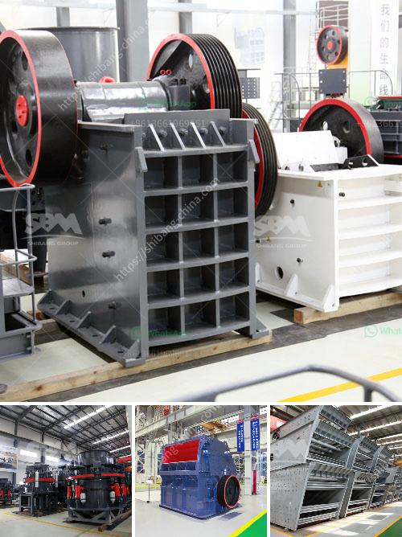

<h3>small coal mining machine</h3>
Coal mining has played a crucial role in the world's energy sector for centuries, providing a reliable source of fuel for power generation and industrial processes. However, traditional coal mining methods have often been associated with safety hazards, environmental concerns, and inefficiencies. To address these challenges head-on, a small coal mining machine has emerged as a revolutionary solution that promises to transform the industry.

The small coal mining machine is a compact, portable, and efficient device designed to extract coal seams with enhanced precision and minimal environmental impact. Equipped with advanced technology and innovative features, this machine is redefining the way coal mining is approached.

One of the key advantages of the small coal mining machine is its size. Unlike large mining equipment that requires extensive infrastructure and resources, this machine can easily navigate tight spaces and reach areas that would otherwise be inaccessible. Its compact design also reduces the need for extensive surface excavations, minimizing disturbances to the surrounding environment.

Furthermore, the small coal mining machine boasts impressive efficiency levels. Equipped with cutting-edge extraction mechanisms, it maximizes the coal recovery process while minimizing waste and reducing the carbon footprint of the mining operation. This leads to more sustainable mining practices and a more efficient utilization of valuable resources.

Safety is always a paramount concern in any mining operation, and the small coal mining machine addresses this issue head-on. With advanced automation features and state-of-the-art safety protocols, it significantly reduces the risk of accidents for workers. Moreover, its compact size allows for better visibility and control, further enhancing the safety of the mining process.

Another noteworthy advantage of the small coal mining machine is its versatility. It can adapt to various coal seam conditions and is capable of maneuvering through challenging terrain. This adaptability ensures that coal deposits can be extracted efficiently, even in geologically complex areas, contributing to increased productivity and profitability for mining companies.

In addition to its practical benefits, the small coal mining machine also has a positive impact on local communities. By reducing the need for large-scale mining operations and their associated infrastructure, it mitigates environmental and social disruptions. This allows for a more harmonious coexistence between mining activities and nearby communities, leading to improved environmental sustainability and community relations.

As the coal mining industry embraces technological advancements, the small coal mining machine is gaining significant traction worldwide. Mining companies are increasingly recognizing the economic, environmental, and safety benefits offered by this innovative equipment. Their adoption of this technology marks a shift towards more sustainable mining practices.

In conclusion, the small coal mining machine represents a significant breakthrough in the coal mining industry. Its compact size, enhanced efficiency, improved safety features, and versatility make it a superior alternative to traditional mining methods. As this technology continues to evolve and gain wider acceptance, it holds the promise of revolutionizing coal mining and paving the way for a more sustainable and efficient future in the energy sector.
<h3>Contact us</h3><ul><li><strong>Whatsapp:&nbsp;<a href="https://wa.me/8613661969651">+8613661969651</a></strong></li><li><a href="https://swt.shibang-china.com/?git&amp;zhl&amp;small coal mining machine"><strong>Online Service(chat now)</strong></a></li></ul><h3>Related</h3><ul><li><a href='limestone ball milling.md'>limestone ball milling</a></li><li><a href='mobile quarry plant.md'>mobile quarry plant</a></li><li><a href='turkey cone crusher.md'>turkey cone crusher</a></li><li><a href='hammer mill diagram.md'>hammer mill diagram</a></li><li><a href='use of the ball mill.md'>use of the ball mill</a></li></ul>