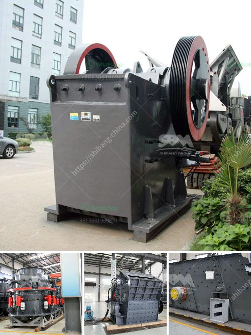

<h3>small crusher machine</h3>
In the modern world, machinery is playing an important role in the construction industry. The construction of new buildings, roads, and bridges requires high-quality materials that can withstand the test of time. One crucial step in the process is the crushing of materials into smaller pieces. This is where small crusher machines come into play.

A small crusher machine is designed to break down materials such as limestone, granite, gravel, and other similar minerals into smaller pieces. These machines are used in a variety of industries, such as mining and construction, where large quantities of material need to be crushed into smaller pieces. They are also used in recycling plants to create smaller, reusable materials from larger pieces.

One of the advantages of small crusher machines is their versatility. With the right attachments and settings, they can be used to crush a wide range of materials. This makes them suitable for different applications, whether it's crushing rocks for road construction, recycling concrete debris, or breaking down limestone for agricultural purposes. Their compact size and ease of use make them an ideal choice for small to medium-sized projects.

Small crusher machines are available in different sizes and configurations to meet various application needs. They can be powered by electricity, diesel engines, or even hydraulic systems. The size and power of the machine depend on the type of material being crushed and the desired output size. For example, a small machine with a jaw crusher can crush larger rocks, while a small machine with a cone crusher can crush finer materials.

Regardless of the specific configuration, all small crusher machines work on the same principle. They consist of a hopper, where the material is loaded, a set of jaws or cones that rotate and crush the material, and a discharge conveyor belt that carries the crushed material away. Some machines also include a screening unit that separates the crushed material into different sizes.

Small crusher machines offer several advantages over larger crushing equipment. Firstly, they are more cost-effective. Their smaller size means they require less energy to operate, reducing operational costs. Additionally, their compact design allows them to be easily transported and set up at different job sites. This makes them particularly suitable for projects with limited space or remote locations.

Furthermore, small crusher machines are more environmentally friendly compared to larger machines. Their smaller size results in reduced noise levels and dust emissions. This is important for projects located in urban areas or sensitive environments where noise and air pollution must be minimized.

In conclusion, small crusher machines are an essential tool in many industries. Their ability to crush various materials into smaller pieces makes them indispensable in construction, mining, and recycling applications. Their versatility, cost-effectiveness, and environmental friendliness make them an attractive choice for small to medium-sized projects. Whether it is crushing rocks, recycling concrete, or processing limestone, small crusher machines offer a reliable crushing solution for different application needs.
<h3>Contact us</h3><ul><li><strong>Whatsapp:&nbsp;<a href="https://wa.me/8613661969651">+8613661969651</a></strong></li><li><a href="https://swt.shibang-china.com/?git&amp;zhl&amp;small crusher machine"><strong>Online Service(chat now)</strong></a></li></ul><h3>Related</h3><ul><li><a href='super orion ball mill for mael powder.md'>super orion ball mill for mael powder</a></li><li><a href='gold shaker wash plant trommel for sale used new.md'>gold shaker wash plant trommel for sale used new</a></li><li><a href='stone crushing business plan.md'>stone crushing business plan</a></li><li><a href='aggregate washing screens in south africa.md'>aggregate washing screens in south africa</a></li><li><a href='ball mill with high quality and best price.md'>ball mill with high quality and best price</a></li></ul>