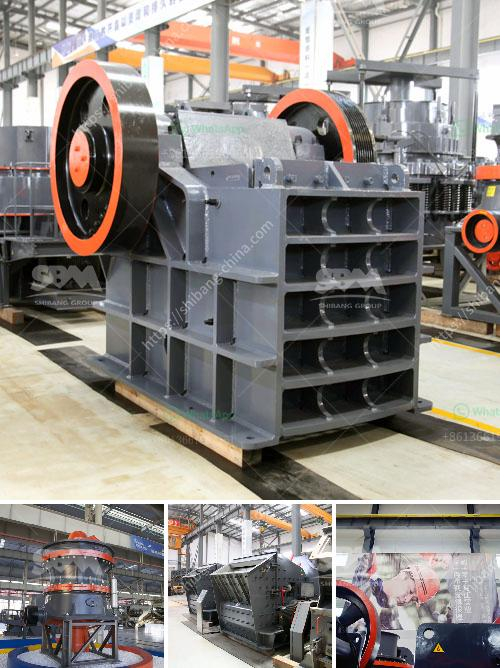

<h3>small diesel engine crusher from tanzania</h3>
Tanzania, being a developing country, faces various challenges in the waste management sector. The disposal of plastic, glass, and metal waste has become a significant concern for both the government and local communities. To tackle this issue, a small diesel engine crusher has been introduced, revolutionizing the waste management system in Tanzania.

The small diesel engine crusher is a powerful piece of machinery that assists in waste management by crushing a variety of waste materials. It operates with a diesel engine, which is known for its fuel efficiency and durability. This crusher can process plastic bottles, aluminum cans, glass bottles, and other waste materials, reducing their size and facilitating easier disposal.

One of the significant advantages of the small diesel engine crusher is its mobility. It can easily be moved to different locations, making it a versatile option for waste management companies, recycling centers, and even small businesses. This feature allows the crusher to adapt to different areas, addressing waste disposal needs in various regions of Tanzania.

Additionally, the small diesel engine crusher is cost-effective when compared to other waste management solutions. It operates on diesel, which is more affordable than electricity in many parts of Tanzania. This makes it an affordable choice for both small and large-scale waste management operations in the country.

Furthermore, the crusher promotes recycling efforts in Tanzania. By reducing the size of waste materials, it becomes easier to handle and transport them. This encourages recycling initiatives as the crushed waste materials can be efficiently sent for further processing or used in the production of new products. The small diesel engine crusher contributes to the circular economy by promoting the reuse of waste materials, reducing their environmental impact.

The introduction of the small diesel engine crusher in Tanzania has had a positive impact on the local community. It has created employment opportunities, especially for individuals who can operate and maintain the crusher. Moreover, waste management companies and recycling centers that incorporate this technology have experienced increased efficiency in their operations, leading to improved waste management practices overall.

To further enhance the impact of the small diesel engine crusher, the Tanzanian government should consider implementing policies and regulations that promote sustainable waste management practices. Financial incentives or tax benefits could be offered to businesses and organizations that adopt this technology, encouraging widespread adoption across the country.

Overall, the small diesel engine crusher from Tanzania has brought significant improvements to waste management practices. Its mobility, cost-effectiveness, and contribution to recycling efforts make it an invaluable asset for the country. By embracing this innovative technology and implementing supportive policies, Tanzania can address its waste management challenges efficiently, while also positively impacting the environment and the local community.
<h3>Contact us</h3><ul><li><strong>Whatsapp:&nbsp;<a href="https://wa.me/8613661969651">+8613661969651</a></strong></li><li><a href="https://swt.shibang-china.com/?git&amp;zhl&amp;small diesel engine crusher from tanzania"><strong>Online Service(chat now)</strong></a></li></ul><h3>Related</h3><ul><li><a href='used stone crusher in germany for sale.md'>used stone crusher in germany for sale</a></li><li><a href='hammer mill chrome ore china.md'>hammer mill chrome ore china</a></li><li><a href='mobile crushing plant in peru.md'>mobile crushing plant in peru</a></li><li><a href='copper ore concentrator suppliers india.md'>copper ore concentrator suppliers india</a></li><li><a href='looking for kaolin processing price.md'>looking for kaolin processing price</a></li></ul>