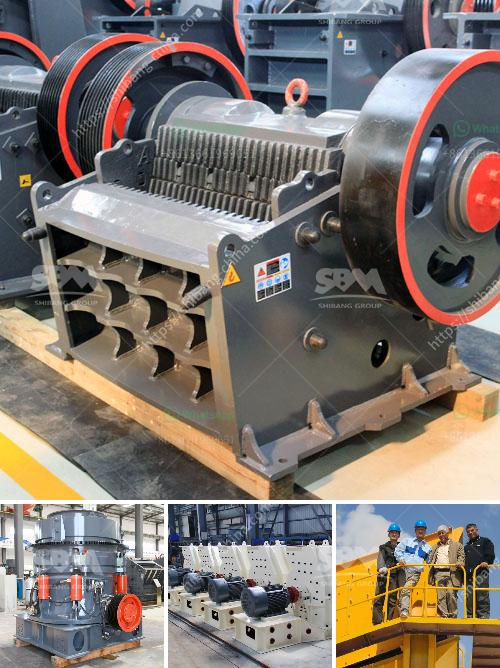

<h3>small gold froth flotation unit</h3>
A small gold froth flotation unit is a crucial piece of equipment for separating valuable minerals from gangue minerals. Commonly used in the mining industry, froth flotation utilizes hydrophobic properties of gold and other minerals to selectively separate them from the surrounding waste material.

The process begins by crushing and grinding the ore to a fine powder. This powder is mixed with water and various reagents, including collectors and frothers. The collectors attach to the gold particles, making them hydrophobic, while the frothers create a stable froth on the surface of the flotation cell.

The mixture is then introduced into the flotation cell, where agitation by mechanical or pneumatic means creates small air bubbles. These bubbles selectively attach to the hydrophobic gold particles, carrying them upward to the froth layer. The gangue minerals, which are hydrophilic, remain in the bulk solution and are discharged as waste.

The froth containing the gold particles is removed from the top of the cell and further processed to extract the desired gold concentrate. This concentrate can be smelted to produce pure gold or subjected to additional refining processes to further purify it.

A small gold froth flotation unit is essential for small-scale gold mining operations as it enables miners to extract maximum value from their ore. By separating valuable minerals from waste material, froth flotation plays a crucial role in ensuring a more sustainable and economically viable mining industry.

In recent years, there has been a growing demand for small-scale mining equipment, including gold froth flotation units. These units are compact, portable, and easy to operate, making them ideal for small mining operations in remote areas. They allow miners to recover gold efficiently and reduce environmental impact by minimizing the use of toxic chemicals.

Overall, a small gold froth flotation unit is a valuable tool for miners looking to maximize their gold recovery while minimizing costs and environmental impact. Its versatility, efficiency, and portability make it a practical choice for small-scale mining operations in various locations worldwide.
<h3>Contact us</h3><ul><li><strong>Whatsapp:&nbsp;<a href="https://wa.me/8613661969651">+8613661969651</a></strong></li><li><a href="https://swt.shibang-china.com/?git&amp;zhl&amp;small gold froth flotation unit"><strong>Online Service(chat now)</strong></a></li></ul><h3>Related</h3><ul><li><a href='feldspar powder plants in andhra pradesh.md'>feldspar powder plants in andhra pradesh</a></li><li><a href='movable gravel crusher.md'>movable gravel crusher</a></li><li><a href='washing plant mining prices.md'>washing plant mining prices</a></li><li><a href='double roll rollers.md'>double roll rollers</a></li><li><a href='stone crushers in belen.md'>stone crushers in belen</a></li></ul>