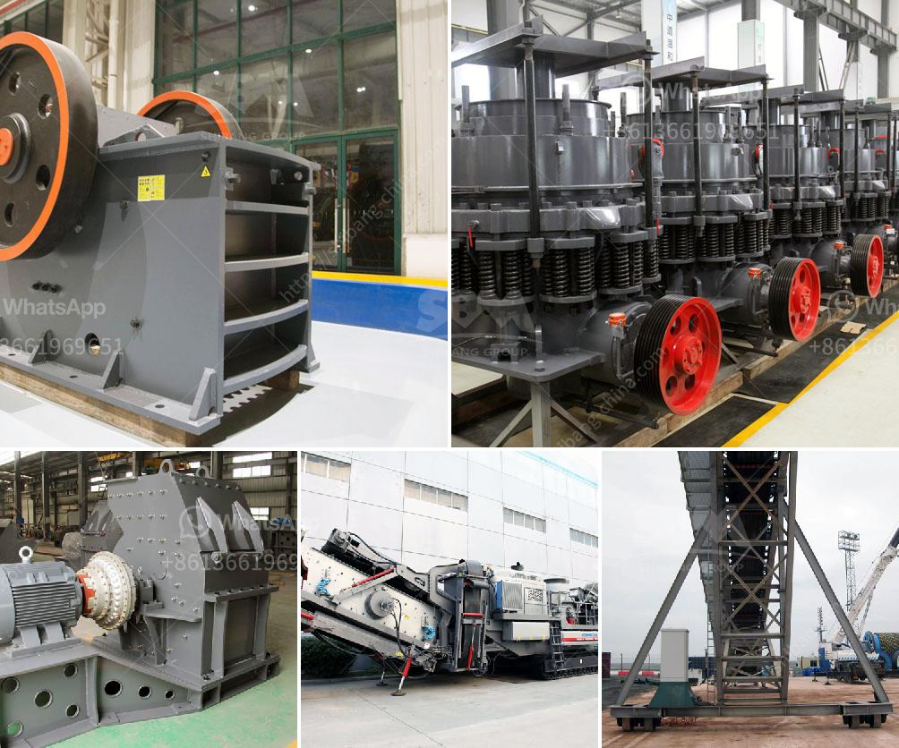

<h3>small hammer mill grinder 10 mm</h3>
A small hammer mill grinder, with a grinding capacity of 10 mm, is a versatile and efficient tool for the processing of various biomass materials into fine powders. It can be used for grinding leaves, grasses, rice husks, and other agricultural materials. This article will discuss the benefits and applications of a small hammer mill grinder in the agricultural industry.

One of the main advantages of using a small hammer mill grinder is its ability to reduce the size of raw materials. By grinding biomass materials into smaller particles, it becomes easier to handle and transport these materials. This is particularly useful in the agricultural industry, where farmers often need to process large quantities of agricultural residues for feed or fuel purposes. A small hammer mill grinder can significantly reduce the size of these materials, making them more manageable and cost-effective to handle.

Additionally, a small hammer mill grinder offers a high grinding efficiency, ensuring that most of the material is finely ground. The grinder's design allows for a consistent and uniform grinding of biomass materials, resulting in a finely ground product that is suitable for various applications. This is especially important when biomass materials are used for animal feed, as finely ground material ensures a more balanced and easily digestible diet for livestock.

Furthermore, a small hammer mill grinder provides versatility in terms of the final product size. By adjusting the grinding settings, users can obtain a wide range of particle sizes, from coarse to fine powders. This flexibility makes it suitable for different applications, such as particle size reduction for pelleting, briquetting, or further processing into biofuels. The ability to control the output particle size allows users to tailor the grinding process to meet specific requirements and maximize the value of the end product.

The compact size of a small hammer mill grinder is another advantage, particularly for small-scale or mobile operations. This equipment can be easily transported and installed in different locations, making it suitable for on-farm grinding or processing in remote areas. By having a portable grinding solution, farmers can minimize transportation costs and time, improving overall efficiency and productivity.

In conclusion, a small hammer mill grinder with a grinding capacity of 10 mm is a valuable tool in the agricultural industry. It offers numerous benefits, including reduced size of biomass materials, high grinding efficiency, versatility in output particle size, and portability. Whether for feed production, energy generation, or other applications, a small hammer mill grinder can efficiently process biomass materials into fine powders, enabling farmers to make better use of their agricultural residues.
<h3>Contact us</h3><ul><li><strong>Whatsapp:&nbsp;<a href="https://wa.me/8613661969651">+8613661969651</a></strong></li><li><a href="https://swt.shibang-china.com/?git&amp;zhl&amp;small hammer mill grinder 10 mm"><strong>Online Service(chat now)</strong></a></li></ul><h3>Related</h3><ul><li><a href='used stone crusher in germany for sale.md'>used stone crusher in germany for sale</a></li><li><a href='mobile crusher malaysia for sell.md'>mobile crusher malaysia for sell</a></li><li><a href='mobile aggregate crusher.md'>mobile aggregate crusher</a></li><li><a href='price on a jaw crusher in south africa.md'>price on a jaw crusher in south africa</a></li><li><a href='stone crushing machine in zambia.md'>stone crushing machine in zambia</a></li></ul>