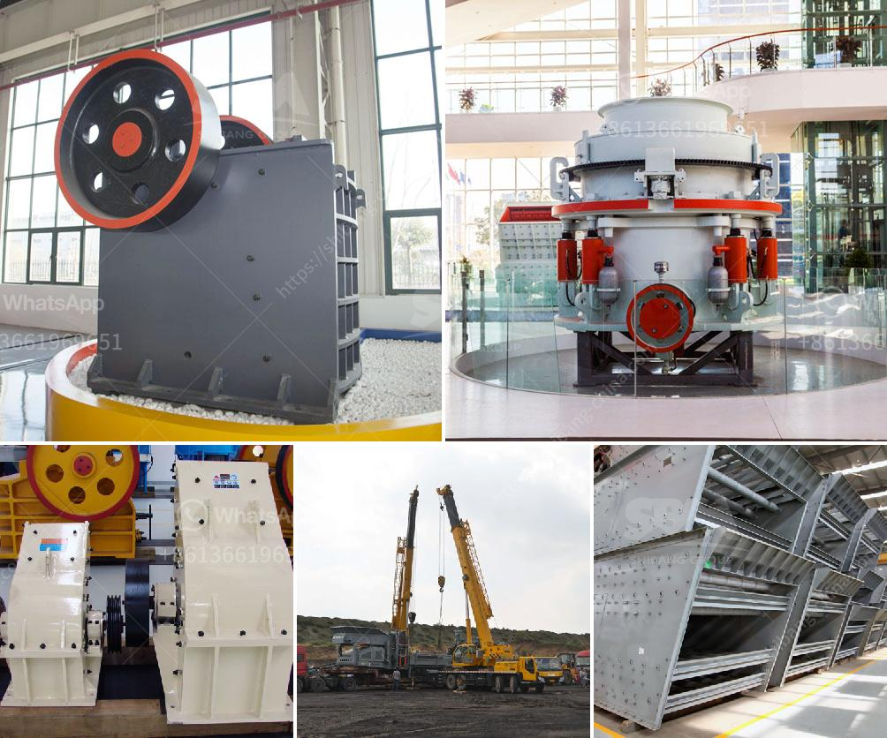

<h3>small jaw crusher supplier</h3>
Crushing and grinding are essential processes in many industries, especially in mining and construction. These industries require sturdy and durable machines to break down large rocks and stones into smaller pieces for further processing. One such machine is the jaw crusher, which has gained significant popularity due to its simplicity, efficiency, and versatility.

A small jaw crusher, also known as a mini jaw crusher, is designed to reduce hard and brittle materials such as rocks and ores into smaller pieces. This machine is widely used in industries like mining, building materials, metallurgy, and chemical engineering, among others. It is ideal for crushing materials with compressive strength less than 320MPa.

When it comes to finding a reliable small jaw crusher supplier, there are several key factors to consider. Firstly, the supplier should have a strong reputation in the industry, with a track record of delivering high-quality products and excellent customer service. Reading customer reviews and testimonials can provide insight into the supplier's reliability and professionalism.

Secondly, the supplier should offer a wide range of jaw crusher models to suit different needs and requirements. A variety of crusher sizes ensures that customers can find the most suitable machine for their specific applications. Additionally, the supplier should provide customization options to cater to unique demands, such as different motor power, feeding size, and crushing capacity.

Moreover, a reputable small jaw crusher supplier should prioritize product quality and durability. The machine's components, including the frame, jaw plate, and eccentric shaft, should be made of robust materials that can withstand heavy-duty crushing operations. High-quality bearings and seals are also crucial for ensuring smooth and efficient operation, while minimizing the risk of breakdowns and downtime.

Another important aspect to consider is aftersales support. A reliable supplier should offer comprehensive technical support, including installation guidance, operation training, and maintenance advice. They should also have a readily available supply of spare parts, ensuring that customers can easily replace any worn-out components and keep their machines running optimally.

Price is another crucial factor when choosing a small jaw crusher supplier. While it is essential to find a supplier that offers competitive prices, it is equally important to prioritize quality over cost. A cheap machine might not be able to deliver the desired crushing performance and might require frequent repairs and replacements, leading to increased expenses in the long run. Therefore, it is advisable to strike a balance between affordability and quality when making a purchasing decision.

In conclusion, finding a reliable small jaw crusher supplier is crucial for businesses in need of a convenient and efficient crushing solution. By considering factors like reputation, product range, quality, aftersales support, and price, customers can ensure that they make the right choice. Investing in a high-quality and durable jaw crusher will not only improve productivity but also minimize maintenance costs and maximize return on investment.
<h3>Contact us</h3><ul><li><strong>Whatsapp:&nbsp;<a href="https://wa.me/8613661969651">+8613661969651</a></strong></li><li><a href="https://swt.shibang-china.com/?git&amp;zhl&amp;small jaw crusher supplier"><strong>Online Service(chat now)</strong></a></li></ul><h3>Related</h3><ul><li><a href='gypsum board manufacturing equipment.md'>gypsum board manufacturing equipment</a></li><li><a href='laying of conveyor belting.md'>laying of conveyor belting</a></li><li><a href='secondary zinc production equipment.md'>secondary zinc production equipment</a></li><li><a href='sand making machine.md'>sand making machine</a></li><li><a href='clinker processing line in germany.md'>clinker processing line in germany</a></li></ul>