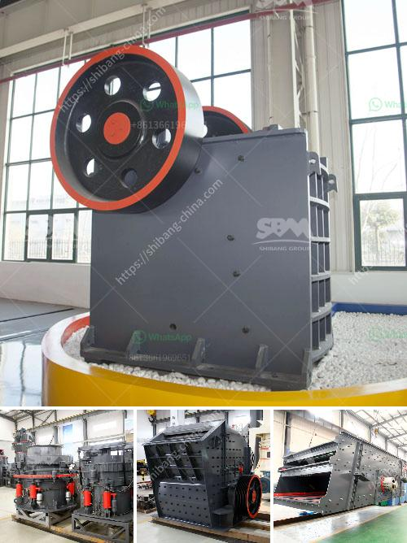

<h3>small jaw crushers</h3>
In the mining industry, rocks and ores are crucial raw materials that need to be processed into valuable products. However, extracting these materials from deep underground comes with its own set of challenges. One such challenge is reducing the size of these materials for further processing. This is where small jaw crushers come into play.

Small jaw crushers are designed to be efficient, with higher reduction ratios and lower power consumption than other crushers. They have a compact design and are well suited for mobile crushing operations. Whether you're looking to crush rock and gravel materials for construction or use them for high-quality aggregate production, small jaw crushers are versatile tools that can save you time and money.

One of the key advantages of small jaw crushers is that they are small in size and highly portable. This allows them to be easily transported to different sites and quickly set up for efficient operation. As a result, these crushers are ideal for reducing the size of materials at mining sites that are difficult to access with larger crushing equipment.

Small jaw crushers are equipped with an uncomplicated hydraulic system that enables smooth operation, even in the harshest of environments. By having a simple design, these crushers require less maintenance, reducing downtime and increasing productivity. With minimal moving parts, small jaw crushers are also less prone to mechanical breakdowns, ensuring a longer lifespan.

When it comes to jaw crushers, the size of the machine determines its crushing capacity. Small jaw crushers typically measure only a few feet in length and weigh around 6,000 pounds. This makes them perfect for smaller-scale mining operations, where space is often limited. Small jaw crushers can be powered by an electric motor or diesel engine, making them highly portable.

Efficiency is key when it comes to crushing materials. A small jaw crusher with high-quality components ensures that the materials are efficiently crushed for further processing. High-performance small jaw crushers are built with advanced technologies that further improve their efficiency. For example, a small jaw crusher with a hydraulic system can produce more consistent and precise end products, while reducing the need for secondary crushing.

Small jaw crushers also have other features that enhance their usability. Many models are equipped with a grizzly feeder, which enables efficient material separation before entering the crusher. This reduces the risk of blockages and ensures smoother operation. Additionally, small jaw crushers may have adjustable settings for the discharge size, allowing you to achieve the desired end product specifications.

In conclusion, small jaw crushers are a handy tool for mining operations that require the reduction of rock and ore into smaller pieces. With their compact design and highly portable nature, small jaw crushers are easy to transport to different sites and quickly set up for efficient crushing. Their simple yet effective hydraulic system reduces downtime and maintenance, making them reliable and cost-effective solutions. When looking for a crushing solution for smaller-scale mining operations, consider investing in a small jaw crusher to save time and increase productivity.
<h3>Contact us</h3><ul><li><strong>Whatsapp:&nbsp;<a href="https://wa.me/8613661969651">+8613661969651</a></strong></li><li><a href="https://swt.shibang-china.com/?git&amp;zhl&amp;small jaw crushers"><strong>Online Service(chat now)</strong></a></li></ul><h3>Related</h3><ul><li><a href='price of stone crusher from china.md'>price of stone crusher from china</a></li><li><a href='ballast crusher for sale in kenya.md'>ballast crusher for sale in kenya</a></li><li><a href='basalt production process.md'>basalt production process</a></li><li><a href='nigeria hammer mill.md'>nigeria hammer mill</a></li><li><a href='conveyor belt indonesia.md'>conveyor belt indonesia</a></li></ul>