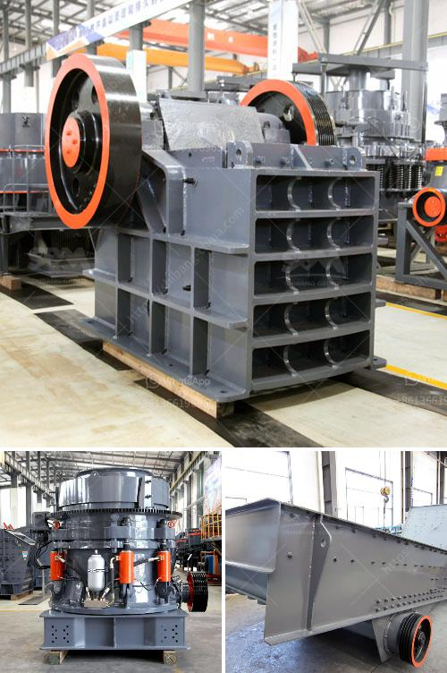

<h3>small rock crushers for recreation</h3>
Small rock crushers are ideal for recreational gold prospectors and hobbyists alike. These powerful machines are designed to crush rocks into a fine powder for further processing and refining. Whether you are working on a small batch of samples or want to make a few ounces of gold, the rock crusher can quickly and easily break down rocks to help release the valuable minerals.

One of the key features of small rock crushers is their portability. These compact-sized machines can easily be transported in a backpack or a small trailer, making them perfect for camping trips or other recreational activities. Their lightweight construction allows you to bring them along wherever you go, and they can be set up quickly and easily.

Another advantage of small rock crushers is their simplicity of operation. These crushers typically have a single toggle mechanism that moves the jaws or plates against the rocks. With limited moving parts, they require minimal maintenance and can be operated by even the most inexperienced users. This makes them accessible to anyone with an interest in rock crushing and gold prospecting.

Furthermore, small rock crushers can be a great way to diversify your recreational activities and enjoy the outdoors. Crushing rocks during a hike or exploring a deserted mining site can add a new sense of adventure to your recreational endeavors. Not only will you get a workout while operating the crusher, but you may also discover hidden treasures and valuable minerals that are waiting to be unearthed.

In conclusion, small rock crushers offer immense benefits for recreational gold prospectors and hobbyists. Their portability, simplicity of operation, and ability to transform rocks into fine powder make them an essential tool for those interested in gold panning, metal detecting, or simply exploring nature with a rock-crushing twist. So, whether you are a weekend warrior or a seasoned prospector, investing in a small rock crusher will undoubtedly enhance your recreational experiences.
<h3>Contact us</h3><ul><li><strong>Whatsapp:&nbsp;<a href="https://wa.me/8613661969651">+8613661969651</a></strong></li><li><a href="https://swt.shibang-china.com/?git&amp;zhl&amp;small rock crushers for recreation"><strong>Online Service(chat now)</strong></a></li></ul><h3>Related</h3><ul><li><a href='calculate crusher wear abrasion.md'>calculate crusher wear abrasion</a></li><li><a href='vertical grinder mill for sale.md'>vertical grinder mill for sale</a></li><li><a href='vertical ultra fine pulverizer.md'>vertical ultra fine pulverizer</a></li><li><a href='vertical shaft impact crusher.md'>vertical shaft impact crusher</a></li><li><a href='rotary grinder machine thailand.md'>rotary grinder machine thailand</a></li></ul>