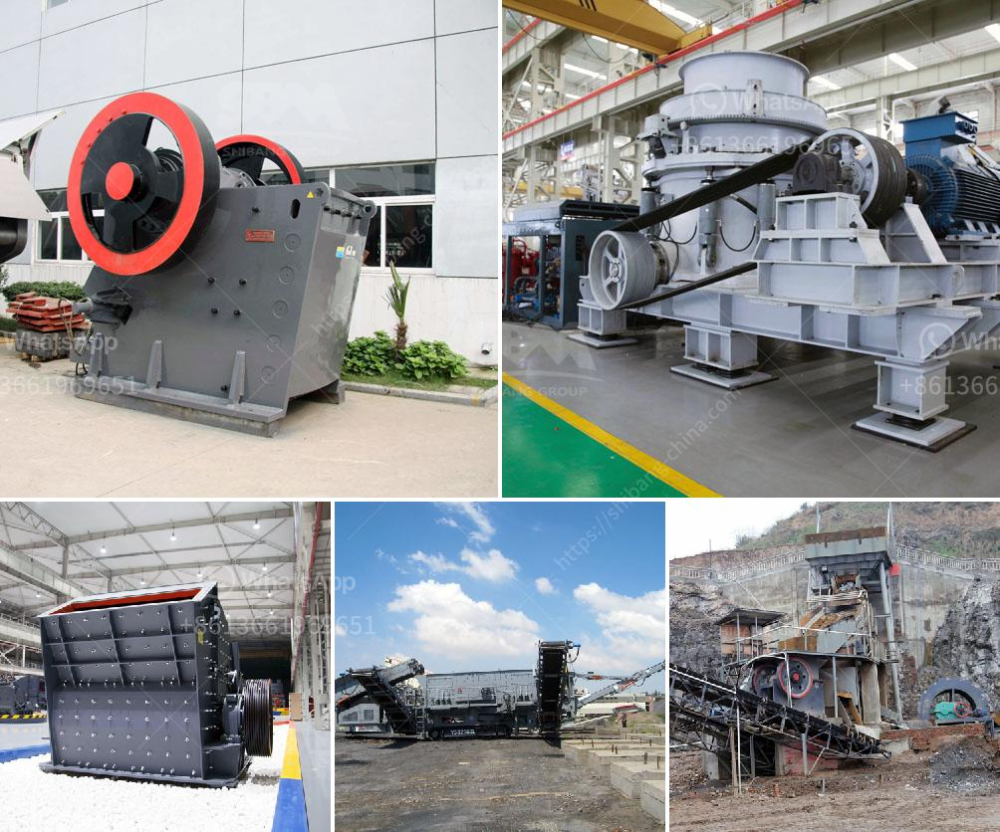

<h3>small rock crushers in turkey</h3>
Small rock crushers are a popular choice for homeowners and contractors who need to crush rocks into smaller, more manageable sizes. These machines offer several benefits over larger crushers, including greater efficiency, portability, and affordability.

One country where small rock crushers are commonly used is Turkey. Turkey is known for its rich history, beautiful landscapes, and vibrant culture. The country is also abundant in natural resources, including a wide variety of rocks and minerals. This makes Turkey an ideal location for rock crushing operations.

Turkey has a long tradition of mining and quarrying, dating back thousands of years. The country's geological diversity makes it an important hub for the extraction of various types of rocks, such as limestone, marble, and basalt. These rocks are widely used in construction projects, road building, and the production of concrete and asphalt.

Small rock crushers in Turkey are designed to crush different types of rocks and stones. They are ideal for reducing the size of rocks without the need for heavy machinery or excessive manpower. These crushers are also portable and easy to transport, making them convenient and efficient for onsite crushing operations.

One of the key advantages of small rock crushers is their affordability. Compared to larger crushers, small rock crushers are much more affordable, making them accessible to a broader range of customers. This is especially beneficial for small businesses and homeowners with limited budgets.

Another advantage of small rock crushers is their versatility. These machines can be used to crush a wide range of rocks, from soft limestone to hard granite. They can handle various sizes, from small pebbles to larger stones, depending on the specific requirements of the project.

Small rock crushers are also relatively easy to operate. They typically have simple controls and can be operated by a single person. This makes them suitable for homeowners and contractors who do not have extensive technical knowledge or experience in crushing rocks.

In Turkey, small rock crushers are commonly used in small-scale construction projects, such as residential developments, road repairs, and landscaping. They can also be used for small-scale mining operations, extracting valuable minerals from rocks and stones.

In conclusion, small rock crushers in Turkey offer numerous benefits over larger crushers. They are affordable, portable, and versatile, making them an excellent choice for homeowners and contractors. With their ability to crush a wide range of rocks and stones, small rock crushers are an essential tool for various construction and mining projects in Turkey.
<h3>Contact us</h3><ul><li><strong>Whatsapp:&nbsp;<a href="https://wa.me/8613661969651">+8613661969651</a></strong></li><li><a href="https://swt.shibang-china.com/?git&amp;zhl&amp;small rock crushers in turkey"><strong>Online Service(chat now)</strong></a></li></ul><h3>Related</h3><ul><li><a href='ball milling method in tamil.md'>ball milling method in tamil</a></li><li><a href='cebu supplier of disposable jaw crusher.md'>cebu supplier of disposable jaw crusher</a></li><li><a href='sand washing plant south africa.md'>sand washing plant south africa</a></li><li><a href='cost to setup mini cement plant in india.md'>cost to setup mini cement plant in india</a></li><li><a href='write an article about jaw crusher philippines prices with 100300 words.md'>write an article about jaw crusher philippines prices with 100-300 words</a></li></ul>