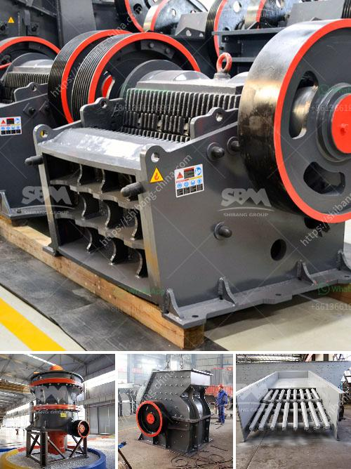

<h3>small sand grinding machine in india</h3>
Small sand grinding machine in India is a tool that is used for grinding and blending materials like sand, cement, and other construction materials. It is widely used in various industries like cement, ceramics, and paint.

In the construction industry, sand and cement are mixed to form a strong and durable mixture. This blend is used for various purposes like constructing buildings, roads, and bridges. To achieve the desired consistency and smoothness of the mixture, a small sand grinding machine is used.

The machine consists of a motor that powers a rotating drum. The drum is filled with sand and other materials, and it spins at a high speed to grind and blend them together. As the drum rotates, friction is created between the materials, resulting in the grinding process.

Small sand grinding machines are typically compact and lightweight, making them easy to transport and operate. They come in different sizes and capacities, ranging from 10 liters to 50 liters or more. The machine is designed to be user-friendly, with simple controls and easy maintenance.

In India, small sand grinding machines are widely used due to their efficiency and effectiveness. They are also cost-effective, making them accessible to small-scale construction businesses and individual contractors.

With the growing demand for construction materials and the need for high-quality mixtures, small sand grinding machines play a crucial role in the industry. They ensure that the materials are properly ground and blended, resulting in a smooth and durable mixture.

In conclusion, small sand grinding machines in India are essential tools for the construction industry. They are efficient, cost-effective, and easy to operate, making them popular among contractors and businesses. These machines contribute to the production of high-quality mixtures, ensuring the durability and strength of construction projects.
<h3>Contact us</h3><ul><li><strong>Whatsapp:&nbsp;<a href="https://wa.me/8613661969651">+8613661969651</a></strong></li><li><a href="https://swt.shibang-china.com/?git&amp;zhl&amp;small sand grinding machine in india"><strong>Online Service(chat now)</strong></a></li></ul><h3>Related</h3><ul><li><a href='crushing plant in pakistan.md'>crushing plant in pakistan</a></li><li><a href='dolomite grinding mill for sale in india.md'>dolomite grinding mill for sale in india</a></li><li><a href='stone crusher pe price.md'>stone crusher pe price</a></li><li><a href='jaw crusher typex.md'>jaw crusher typex</a></li><li><a href='large scale mining vs small scale mining.md'>large scale mining vs small scale mining</a></li></ul>