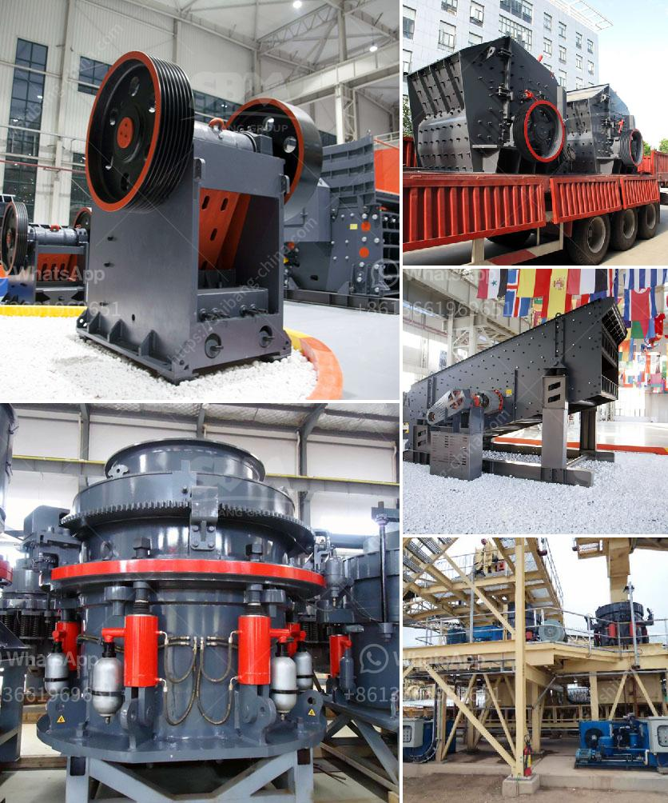

<h3>small scale gold mining equipment in south africa</h3>
Small scale gold mining equipment in South Africa has gained much admiration from investors and small miners. The gold industry in South Africa may be dying, but the mining equipment suppliers in South Africa continue to thrive. There are countless firms that provide the necessary equipment and skills to mine for gold throughout the region.

These small scale mining equipment are not only practical for small-scale mining but are also believed to have a positive impact on the environment. This is because they require less infrastructure compared to larger mines, reducing the need for space and energy consumption. Additionally, small scale mining equipment is versatile and can be used in various aspects of the gold mining process, such as panning, sluicing, and dredging.

One of the essential equipment for small scale gold mining is a gold pan, which is a shallow dish with ribs on the bottom. The gold pan is used to collect and separate gold from sediment and debris. Small scale miners often use a sluice box, which consists of a series of riffles or small barriers to trap the heavier gold particles as water flows through it.

Another crucial piece of equipment for small scale gold mining is a dredger. These machines are used to extract gold particles from the bottom of rivers and streams. Dredgers come in various sizes, from small handheld units to larger, more powerful machines. They can effectively extract gold particles and separate them from other materials such as sand and gravel.

Shaking tables are also commonly used in small scale gold mining operations. These tables use a shaking motion to separate gold particles from gangue minerals. The shaking motion, combined with water, helps to separate the heavier gold particles from the lighter materials, enabling efficient gold recovery.

Small scale mining equipment suppliers in South Africa also offer gold dry wash plants. These plants are used to separate gold particles from sand and gravel, without the use of water. Dry wash plants are especially popular in areas with limited access to water, as they allow miners to recover gold without the need for a water source.

Overall, small scale gold mining equipment in South Africa is ideal for small-scale miners and individuals who wish to start gold mining projects. Small scale mining equipment offers several benefits, such as minimal environmental impact, reduced infrastructure requirements, and versatility in gold extraction methods. With the necessary equipment and skills, small scale miners can contribute to the local economy and help sustain the gold mining industry in South Africa.

In conclusion, small scale gold mining equipment in South Africa continues to play a significant role in the country's gold mining industry. It provides an opportunity for small-scale miners to contribute to economic development and keeps the gold mining industry alive. With the right equipment and proper mining techniques, small scale miners can extract gold efficiently while minimizing the negative impact on the environment.
<h3>Contact us</h3><ul><li><strong>Whatsapp:&nbsp;<a href="https://wa.me/8613661969651">+8613661969651</a></strong></li><li><a href="https://swt.shibang-china.com/?git&amp;zhl&amp;small scale gold mining equipment in south africa"><strong>Online Service(chat now)</strong></a></li></ul><h3>Related</h3><ul><li><a href='china gold processing plant.md'>china gold processing plant</a></li><li><a href='crusher price malaysia.md'>crusher price malaysia</a></li><li><a href='3 roller raymond mill.md'>3 roller raymond mill</a></li><li><a href='stone crusher kenya.md'>stone crusher kenya</a></li><li><a href='gypsum board machinery manufacturers india.md'>gypsum board machinery manufacturers india</a></li></ul>