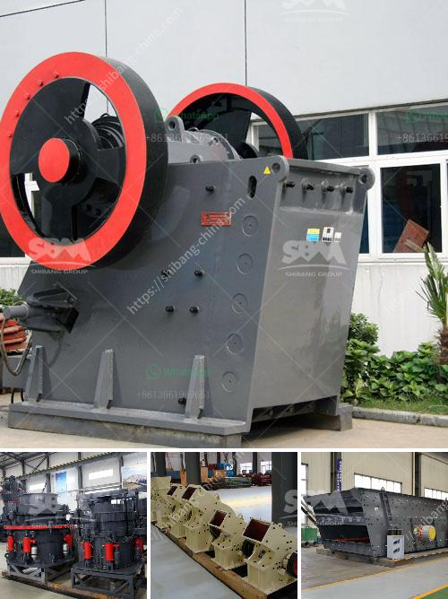

<h3>small scale gold mining in kadoma zimbabwe</h3>
Small-scale gold mining in Kadoma, Zimbabwe has become a lucrative economic activity, providing livelihoods for many impoverished people. Mining, especially for gold, plays a vital role in the country's economy. With the mineral being a key foreign currency earner and employment provider, it is widely embraced by communities.

Kadoma, a city located in Mashonaland West Province, is the epicenter of small-scale gold mining. The city owes its existence to gold mining, as it emerged as a result of the gold rush in the late 1800s. The town rapidly grew as prospectors discovered gold in the surrounding areas. Today, it is home to thousands of artisanal and small-scale miners who have dedicated their lives to this industry.

One of the key drivers of small-scale gold mining in Kadoma is the lack of alternative income-generating opportunities, prompting many individuals to venture into mining. The unemployment rate in Zimbabwe remains high, and the formal job market does not absorb the growing workforce. As a result, individuals turn to small-scale gold mining as a means of sustenance and providing for their families.

The artisanal and small-scale gold mining sector in Kadoma is characterized by rudimentary mining methods and tools. Miners often use basic hand tools such as picks, shovels, and hammers, as well as simple machinery like homemade sluice boxes and small ball mills. These low-cost methods enable individuals to start mining and earn an income without significant capital investment.

Despite the challenges they face, small-scale miners in Kadoma are resilient and determined. They demonstrate great skill and resourcefulness in their activities, extracting gold from the earth using their limited resources. Many of these miners possess vast knowledge of the geological formations in the area, allowing them to identify potential gold-bearing areas with high accuracy.

However, the sector also faces several challenges, including environmental degradation and health risks for miners. The use of mercury in gold extraction is prevalent among small-scale miners, contributing to water pollution and harmful health effects for both miners and surrounding communities. This issue calls for greater awareness and implementation of environmentally friendly mining practices.

Moreover, the lack of formal regulation and the presence of illegal gold buyers on the market create an environment prone to exploitation and corruption. Illegal gold buyers often take advantage of small-scale miners by offering low prices and engaging in unfair business practices.

To address these challenges, the Zimbabwean government has made efforts to formalize and regulate the small-scale gold mining sector. The introduction of the Mines and Minerals Amendment Bill aims to establish a legal framework that ensures responsible and sustainable mining practices. The government also encourages miners to form cooperatives to enhance their bargaining power and gain access to finance and equipment.

Small-scale gold mining in Kadoma, Zimbabwe is a complex phenomenon with both positive and negative aspects. While it serves as an important source of income and livelihood for many, it also poses environmental and health risks. Efforts to regulate the sector and promote responsible mining practices are necessary to ensure its long-term sustainability and benefit the community as a whole.
<h3>Contact us</h3><ul><li><strong>Whatsapp:&nbsp;<a href="https://wa.me/8613661969651">+8613661969651</a></strong></li><li><a href="https://swt.shibang-china.com/?git&amp;zhl&amp;small scale gold mining in kadoma zimbabwe"><strong>Online Service(chat now)</strong></a></li></ul><h3>Related</h3><ul><li><a href='malaysia tin ore cursher supplier.md'>malaysia tin ore cursher supplier</a></li><li><a href='sand manufacturing machine price in tamilnadu.md'>sand manufacturing machine price in tamilnadu</a></li><li><a href='used marble machinery turkey.md'>used marble machinery turkey</a></li><li><a href='sand washing plant saudi arabia.md'>sand washing plant saudi arabia</a></li><li><a href='gold mining equipment for sale in egypt.md'>gold mining equipment for sale in egypt</a></li></ul>