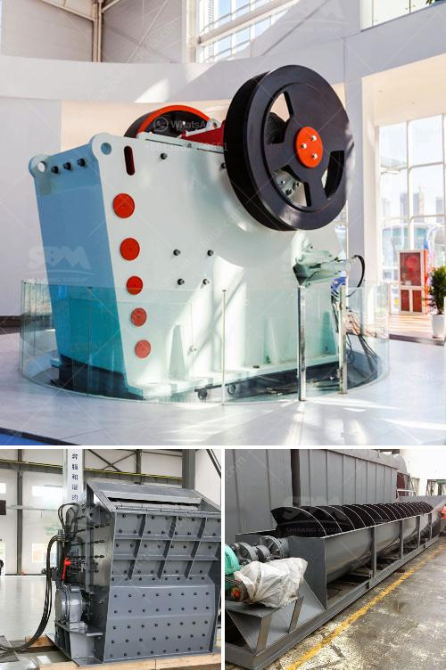

<h3>small scale gold mining plant in zimbabwe</h3>
Small-scale gold mining is a crucial livelihood activity for millions of people in Zimbabwe. In recent years, it has become the main source of income for a significant number of households in rural areas. As the country grapples with economic hardships and unemployment, more and more people are turning to this sector to make ends meet.

A small-scale gold mining plant, commonly known as mining mills, is a rudimentary, rudimentary plant created to extract valuable minerals from rocks using rudimentary tools and methods. It has been used by miners for centuries because it is a very effective and simple technique to extract gold particles from the ore.

Most small-scale gold mining plants in Zimbabwe are mainly concentrated in the gold belt area, which stretches from Kwekwe to Kadoma. This area has abundant gold deposits, making it attractive for artisanal miners. The mining operations are usually carried out by individuals or small groups, using basic equipment such as sieves, shovels, and pans.

The process typically begins by crushing the ore into smaller particles, then panning or using a sluice box to extract the gold particles from the concentrate. Mercury is often used to separate the gold from other minerals. This is a dangerous method as it poses health risks to the miners and has adverse environmental impacts.

The gold extracted from these small-scale mining plants is mostly sold to local gold buyers or directly to the black market. There is a lack of government control and regulation in this sector, which creates opportunities for illegal activities, including smuggling and tax evasion.

The proliferation of small-scale gold mining plants has had both positive and negative impacts on the local communities. On the one hand, it provides job opportunities and income for many individuals who would otherwise be unemployed. It also contributes to the local economy through the sale of gold and other products.

On the other hand, the unregulated nature of the industry has resulted in various social and environmental problems. Miners often work under hazardous conditions, risking their health and safety. The use of mercury leads to water and soil pollution, affecting both human health and the ecosystem.

To address these issues, the government of Zimbabwe needs to strengthen its regulatory framework for small-scale gold mining plants. Proper training and equipment should be provided to miners to ensure their safety and reduce environmental impacts. Additionally, efforts should be made to formalize the sector, improve mining practices, and promote sustainable development in these communities.

In conclusion, small-scale gold mining plants play a significant role in Zimbabwe's economy, providing a livelihood for many individuals. However, it is essential to strike a balance between economic benefits and environmental sustainability. With proper regulation and support, this sector has the potential to contribute to the country's development while safeguarding the well-being of its people and the environment.
<h3>Contact us</h3><ul><li><strong>Whatsapp:&nbsp;<a href="https://wa.me/8613661969651">+8613661969651</a></strong></li><li><a href="https://swt.shibang-china.com/?git&amp;zhl&amp;small scale gold mining plant in zimbabwe"><strong>Online Service(chat now)</strong></a></li></ul><h3>Related</h3><ul><li><a href='petroleum coke grinding.md'>petroleum coke grinding</a></li><li><a href='rental crusher rinda.md'>rental crusher rinda</a></li><li><a href='mill manufactures of hammer aryesanal.md'>mill manufactures of hammer aryesanal</a></li><li><a href='16 mesh silica sand crusher.md'>16 mesh silica sand crusher</a></li><li><a href='vertical grinder mill price.md'>vertical grinder mill price</a></li></ul>