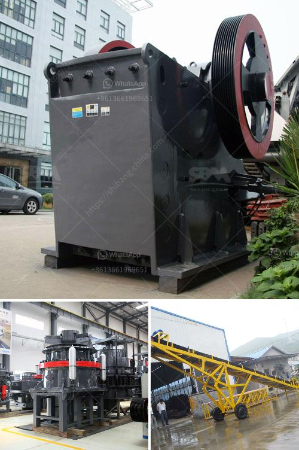

<h3>small scale iron ore pallet plant</h3>
A small-scale iron ore pellet plant represents a potential approach to utilizing the country's indigenous iron ore resources to produce more value-added iron and steel products. With the increasing emphasis on promoting industrialization and reducing dependency on imported products, such a plant can play a significant role in fostering economic growth and creating job opportunities in the region.

Iron ore pellets are small balls of iron ore used in the production of steel. They are made from a mixture of iron ore fines (small particles of iron ore) and a binder consisting of bentonite clay and other additives. The raw material for these pellets is usually obtained from open-pit mines or underground mines.

The process of pelletizing involves blending the iron ore fines with the binder and passing the mixture through a pelletizing disc or balling drum. As the pellets are formed, a thermal treatment is applied to harden them, making them suitable for transportation and handling.

A small-scale iron ore pellet plant typically consists of a rotary kiln, pellet cooler, disc pelletizer, balling drum, and other associated equipment. These plants are designed with a capacity range of 200-500 tons per day. The technology used in such plants is quite simple and straightforward, requiring less capital investment compared to larger-scale pelletizing plants. Additionally, they can be modular in design, easily expandable, and adjusted to the requirements of different ore types.

There are several advantages of establishing small-scale iron ore pellet plants. Firstly, it creates employment opportunities for local communities, contributing to regional development and poverty reduction. Secondly, it helps in the conservation of high-grade iron ore resources by utilizing lower-grade materials that are otherwise not economically viable for large-scale plants. This, in turn, increases the overall efficiency of the iron ore utilization process.

Moreover, small-scale pellet plants can be strategically located near the iron ore mines to minimize transportation costs and reduce the carbon footprint associated with long-distance haulage. Additionally, they provide local steel manufacturers with access to a consistent supply of high-quality pellets, promoting the growth of downstream steel industries.

However, establishing a small-scale iron ore pellet plant is not without challenges. The availability of suitable raw materials, including iron ore fines and binders, needs to be ensured. Adequate infrastructure, including power supply, water, and transportation, is essential. Access to skilled labor and technical expertise is also crucial for the successful operation of such plants. Lastly, securing financing and navigating regulatory processes are additional factors that need to be considered.

In conclusion, a small-scale iron ore pellet plant represents a viable option for utilizing indigenous iron ore resources and promoting local economic development. With proper planning and investment, it can contribute to the growth of the iron and steel industry while creating employment opportunities and reducing import dependency. However, careful consideration of raw material availability, infrastructure requirements, and financing options is necessary to ensure the successful establishment and operation of such plants.
<h3>Contact us</h3><ul><li><strong>Whatsapp:&nbsp;<a href="https://wa.me/8613661969651">+8613661969651</a></strong></li><li><a href="https://swt.shibang-china.com/?git&amp;zhl&amp;small scale iron ore pallet plant"><strong>Online Service(chat now)</strong></a></li></ul><h3>Related</h3><ul><li><a href='coal crusher types.md'>coal crusher types</a></li><li><a href='dubai stone crushing auction.md'>dubai stone crushing auction</a></li><li><a href='calcium carbonate machine supplier in turkey.md'>calcium carbonate machine supplier in turkey</a></li><li><a href='stone crushers made in greece.md'>stone crushers made in greece</a></li><li><a href='laying of conveyor belting.md'>laying of conveyor belting</a></li></ul>