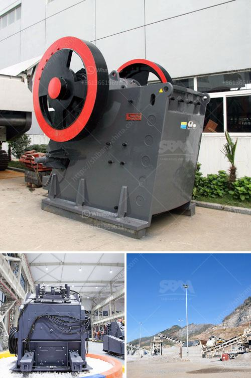

<h3>small stone crusher for sale</h3>
Small stone crusher is a small-sized machine, especially for the crushing of small particle size materials. Small stone crusher is usually equipment with some kind of movement detection device, mainly used in the Metallurgy, mining, chemical, cement, construction, refractory materials and ceramics industries. Crushing process is minimized to a certain extent under the action of external force, making these small stones easy to be crushed into smaller particles.

Small stone crusher for sale is comprised of various machines. The crusher consists of a compression chamber, hopper, vibrating feeder, crusher shaft, and a motor. In terms of operation, the vibrator feeder drives the crusher shaft, and the hopper helps in feeding the stones properly. It also has a small conveying system, such as a belt conveyor, which efficiently transports the crushed stones to the next stage of production.

Crushers are used in many industries to crush a variety of materials. Small stone crusher, for instance, plays an essential role in recycling the rubble. It is the best suited machine for those who want to save their energy and time. Without compromising on productivity, small stone crusher for sale can handle a large quantity of materials at a certain level of granularity. It can crush stones of various sizes and shapes, making it an ideal machine in industries where materials of different sizes need to be processed.

Apart from being used in industries, small stone crushers are also useful for construction purposes. They can be used to break down stones into gravel that can be used for construction projects like roads, buildings, and bridges. These crushers are also useful for farmers who need to convert rocks into manure for their fields. Small stone crushers reduce excessive amounts of stone in farmlands to keep the soil fertile.

Overall, small stone crusher for sale is useful for anyone in need of crushing and processing materials. With the right equipment, users can save time and energy whilst obtaining the highest quality crushed stones for their projects and businesses.
<h3>Contact us</h3><ul><li><strong>Whatsapp:&nbsp;<a href="https://wa.me/8613661969651">+8613661969651</a></strong></li><li><a href="https://swt.shibang-china.com/?git&amp;zhl&amp;small stone crusher for sale"><strong>Online Service(chat now)</strong></a></li></ul><h3>Related</h3><ul><li><a href='crusher for stone stone.md'>crusher for stone stone</a></li><li><a href='quarry equipment in kenya.md'>quarry equipment in kenya</a></li><li><a href='mobile vibrating screen.md'>mobile vibrating screen</a></li><li><a href='stone crusher machine for sale uae.md'>stone crusher machine for sale uae</a></li><li><a href='limestone crushing processing for the manufacture.md'>limestone crushing processing for the manufacture</a></li></ul>