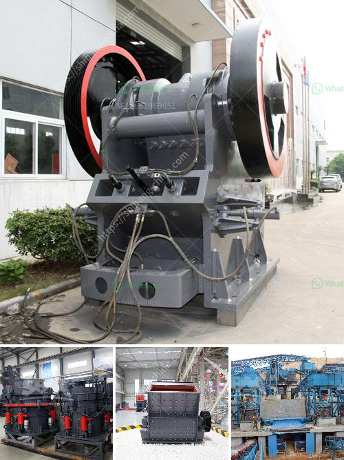

<h3>small stone crushing machine</h3>
Crushing stones is one of the oldest and most widely used methods of breaking down bulk materials into smaller pieces. Known as aggregates, these materials play a crucial role in constructing highways, buildings, and other infrastructure projects.

In order to fulfill the growing demand for these materials, small stone crushing machines have emerged as a reliable solution. Whether you are constructing a road, maintaining a gravel driveway, or simply renovating an existing structure, these machines prove to be invaluable.

Small stone crushing machines are economical and highly efficient. They have a simple structure, consisting mainly of a strong metal frame and an eccentric shaft that powers the crushing mechanism. With the right choice of blades and additional attachments, these machines can easily and effectively break down even the hardest stones into desirable sizes.

One of the key advantages of these machines is their portability. With the help of wheels and a hitch, they can be easily transported to and from different work locations. This allows for increased flexibility and independence for any project, regardless of its scale or specifications.

Furthermore, small stone crushing machines are designed with ease of use and maintenance in mind. The operator-friendly interfaces and simple operating mechanisms ensure that anyone can efficiently operate these machines without requiring extensive training. Additionally, maintenance and cleaning can be done quickly and easily, minimizing downtime during busy periods.

The small stone crushing machines available in the market are highly robust and are designed to withstand the rigors of heavy-duty construction work. Reliable and durable, these machines enable users to increase productivity and reduce costs associated with labor.

In conclusion, small stone crushing machines offer a reliable and efficient solution for various construction projects. They are perfect for reducing the size of stones, bricks, and concrete blocks for future usage. With its reliable performance, ease of use, and maintenance, these machines have successfully established themselves in the construction industry and continue to prove their worth day in and day out.
<h3>Contact us</h3><ul><li><strong>Whatsapp:&nbsp;<a href="https://wa.me/8613661969651">+8613661969651</a></strong></li><li><a href="https://swt.shibang-china.com/?git&amp;zhl&amp;small stone crushing machine"><strong>Online Service(chat now)</strong></a></li></ul><h3>Related</h3><ul><li><a href='chrome ore crushers for hire in south africa.md'>chrome ore crushers for hire in south africa</a></li><li><a href='roller mill price.md'>roller mill price</a></li><li><a href='land rock crusher sale.md'>land rock crusher sale</a></li><li><a href='plant for manufacturing of wet ground calcium carbonate.md'>plant for manufacturing of wet ground calcium carbonate</a></li><li><a href='dolomite powder grinding mill in india.md'>dolomite powder grinding mill in india</a></li></ul>