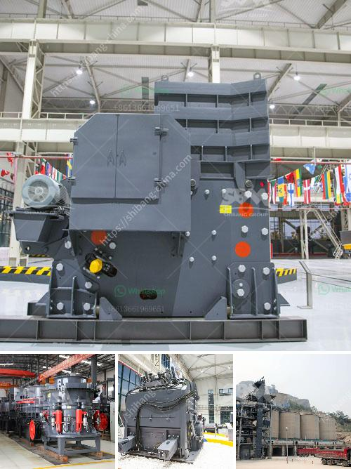

<h3>small superfine grinder price malaysia</h3>
If you are someone who enjoys brewing your coffee or grinding your own spices, investing in a small superfine grinder can greatly enhance the flavors and aromas of your creations. In Malaysia, finding the perfect grinder at an affordable price can be a challenge. However, with some research and comparison, you can find quality small superfine grinders that meet your needs without breaking the bank.

The price range for small superfine grinders in Malaysia can vary significantly depending on the brand, features, and materials used. Generally, you can find grinders priced between RM100 to RM500, but it's essential to consider the specifications and performance before making a purchase.

One popular option in the Malaysian market is the XYZ Superfine Grinder. Priced at around RM200, this grinder offers impressive features for its price range. It boasts a powerful motor that can grind coffee beans, nuts, and spices efficiently. The stainless steel blades ensure consistent and uniform grinding, producing superfine results. Despite its compact size, it has a generous capacity to accommodate larger quantities of ingredients, making it suitable for both personal use and small gatherings.

For those with a slightly higher budget, the ABC Ultra Grind is another excellent choice. Priced at RM400, this grinder is considered a higher-end option in terms of price, but it offers exceptional performance. Its sleek and modern design will enhance the aesthetics of your kitchen, and the precision grind settings allow you to achieve the desired coarseness or fineness of the ingredients. Its durability is another selling point, as the grinder is made from top-quality materials that ensure long-lasting use.

If you are on a tight budget but still want a reliable superfine grinder, the DEF Mini Grinder may be the perfect option for you. This grinder is priced around RM100, making it one of the more affordable choices available. Despite its lower price, it does not compromise on functionality. It features a compact design, making it easy to store in small kitchens or limited countertop space. The stainless steel blades are sharp and efficient, enabling you to grind a variety of ingredients to a superfine consistency.

When searching for the perfect small superfine grinder, it's essential to consider factors such as motor power, blade quality, capacity, and durability. Additionally, reading customer reviews and comparing prices from different retailers can help you make an informed decision.

Ultimately, finding a small superfine grinder at an affordable price in Malaysia is possible with a bit of research and patience. Whether you are a coffee enthusiast or someone who enjoys experimenting with spices, investing in a quality grinder can elevate your culinary creations to a whole new level of flavor and aroma. So, start exploring the market, compare prices, and choose the grinder that suits your needs and budget.
<h3>Contact us</h3><ul><li><strong>Whatsapp:&nbsp;<a href="https://wa.me/8613661969651">+8613661969651</a></strong></li><li><a href="https://swt.shibang-china.com/?git&amp;zhl&amp;small superfine grinder price malaysia"><strong>Online Service(chat now)</strong></a></li></ul><h3>Related</h3><ul><li><a href='method statement of installation conveyor belt.md'>method statement of installation conveyor belt</a></li><li><a href='ball mill making from turkey.md'>ball mill making from turkey</a></li><li><a href='sale limestone crusher malaysia.md'>sale limestone crusher malaysia</a></li><li><a href='quarry machine and crusher plant sale in australia.md'>quarry machine and crusher plant sale in australia</a></li><li><a href='how to make talcum powder.md'>how to make talcum powder</a></li></ul>