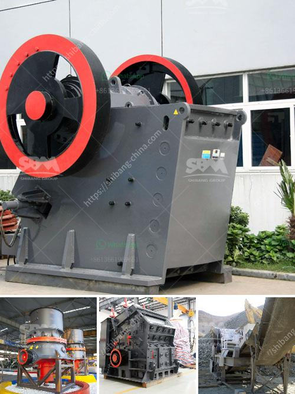

<h3>smallest mobile jaw crusher for sale south africa</h3>
The mobile jaw crusher range from Komplet is a compact and efficient solution for crushing construction and demolition waste, as well as stones and rocks. It's a game changer for small scale projects such as residential construction, road construction, and demolition, reshaping the landscape in an environmentally friendly way.

One standout feature of the Komplet mobile jaw crusher range is its ability to be maneuvered into tight spaces. This is thanks to its compact size, with the smallest model, the LT 4825, only measuring 1.9 meters in length and 700mm in width. Despite its compact dimensions, this machine can still produce up to 15-20 tons per hour of crushed material. This makes it ideal for small scale operations that need a reliable and efficient crusher on site.

In addition to its small footprint, the Komplet mobile jaw crusher is easy to transport. It can be towed to and from the site by a standard 1.5-ton pickup truck, allowing for easy transportation between different job sites. This mobility is crucial for small scale projects where multiple locations need to be serviced.

The compact size and mobility of the Komplet mobile jaw crusher also make it highly versatile. It can be used in various applications depending on the type of material being crushed. It is suitable for crushing concrete, asphalt, stones, and rocks. This flexibility ensures that the machine can be utilized in different projects, making it a cost-effective investment.

Another key advantage of the Komplet mobile jaw crusher is its low operating costs. The machine is powered by a diesel engine, which consumes less fuel compared to traditional crushers. This results in significant savings in fuel expenses, making it an economical choice for small scale projects. Additionally, the crusher has low maintenance requirements, minimizing downtime and reducing maintenance costs.

The small mobile jaw crusher also offers environmental benefits. It allows for on-site recycling of construction and demolition waste, reducing the need for transporting materials to off-site recycling centers. This not only saves transportation costs but also reduces carbon emissions associated with transportation. Furthermore, the crusher's compact size reduces noise pollution, making it a suitable choice for urban environments.

In conclusion, the smallest mobile jaw crusher from Komplet is a compact and efficient solution for crushing construction and demolition waste, stones, and rocks. It offers a cost-effective and environmentally friendly solution for small scale projects, allowing operators to recycle waste on-site or create aggregates for use in other construction applications. Its compact size, mobility, and low operating costs make it a versatile and economical choice for small scale operations in South Africa.
<h3>Contact us</h3><ul><li><strong>Whatsapp:&nbsp;<a href="https://wa.me/8613661969651">+8613661969651</a></strong></li><li><a href="https://swt.shibang-china.com/?git&amp;zhl&amp;smallest mobile jaw crusher for sale south africa"><strong>Online Service(chat now)</strong></a></li></ul><h3>Related</h3><ul><li><a href='crusher for sale in kenya.md'>crusher for sale in kenya</a></li><li><a href='continous ball mill with cyclone suppliers in india.md'>continous ball mill with cyclone suppliers in india</a></li><li><a href='ballast crushing machine in kenya.md'>ballast crushing machine in kenya</a></li><li><a href='small crusher machine.md'>small crusher machine</a></li><li><a href='small jaw crushers.md'>small jaw crushers</a></li></ul>