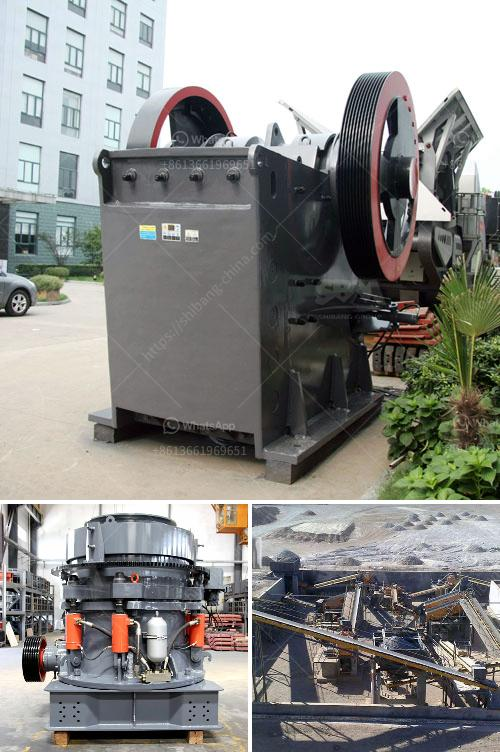

<h3>smallfine powder grinding machine nigeria</h3>
Small fine powder grinding machine is a popular investment option in Nigeria. With the continuous improvement of people's living standards, the demand for fine powder is increasing. Many investors see the prospect of the small fine powder grinding machine in Nigeria and have invested in it.

The small fine powder grinding machine has full functions, high efficiency, and low energy consumption. It is a small-sized grinding machine with compact structure, high efficiency, stability, and reliability. The machine adopts stainless steel material, which can ensure the sanitation and safety of the materials processed. The machine also has the characteristics of smooth operation, low noise, and convenient maintenance.

One of the advantages of the small fine powder grinding machine is its wide range of applications. It can grind various materials, such as grains, spices, herbs, and other dry materials. With different grinding blades, it can also grind materials with different fineness requirements. Therefore, the small fine powder grinding machine is widely used in pharmaceuticals, chemical industry, food industry, and other fields.

In the pharmaceutical industry, the small fine powder grinding machine is essential for the production of various medicines and health products. It can crush materials into fine powder with uniform particle size, which is convenient for the subsequent processing and preparation of medicines. The machine can effectively improve the dissolution rate and absorption rate of drugs, making the drug effect more significant.

In the food industry, the small fine powder grinding machine is widely used in the production of various seasonings, flavors, and spices. It can crush and grind various spices into fine powder, effectively preserving the flavor and aroma of the spices. With the development of the catering industry, the demand for spices and seasonings has increased, promoting the popularity of small fine powder grinding machines in the market.

Moreover, the small fine powder grinding machine is also suitable for grinding materials such as dried fruits, nuts, and herbal medicines. It can effectively maintain the original taste and nutrients of the materials, making them more convenient for consumption and storage.

In conclusion, the small fine powder grinding machine has great potential in Nigeria. It offers various advantages, such as high efficiency, wide range of applications, and low energy consumption. With the continuous improvement of people's living standards and the development of industries, the demand for fine powder grinding machines is increasing. Investing in a small fine powder grinding machine in Nigeria is a wise choice for many investors to tap into this growing market.
<h3>Contact us</h3><ul><li><strong>Whatsapp:&nbsp;<a href="https://wa.me/8613661969651">+8613661969651</a></strong></li><li><a href="https://swt.shibang-china.com/?git&amp;zhl&amp;smallfine powder grinding machine nigeria"><strong>Online Service(chat now)</strong></a></li></ul><h3>Related</h3><ul><li><a href='screw conveyor blade calculation.md'>screw conveyor blade calculation</a></li><li><a href='equipment required for producing lime for new plant.md'>equipment required for producing lime for new plant</a></li><li><a href='setting up of a stone quarry plant in nigeria.md'>setting up of a stone quarry plant in nigeria</a></li><li><a href='3tph ball mill for gold ore processing.md'>3tph ball mill for gold ore processing</a></li><li><a href='sample business plan for a stone mining.md'>sample business plan for a stone mining</a></li></ul>