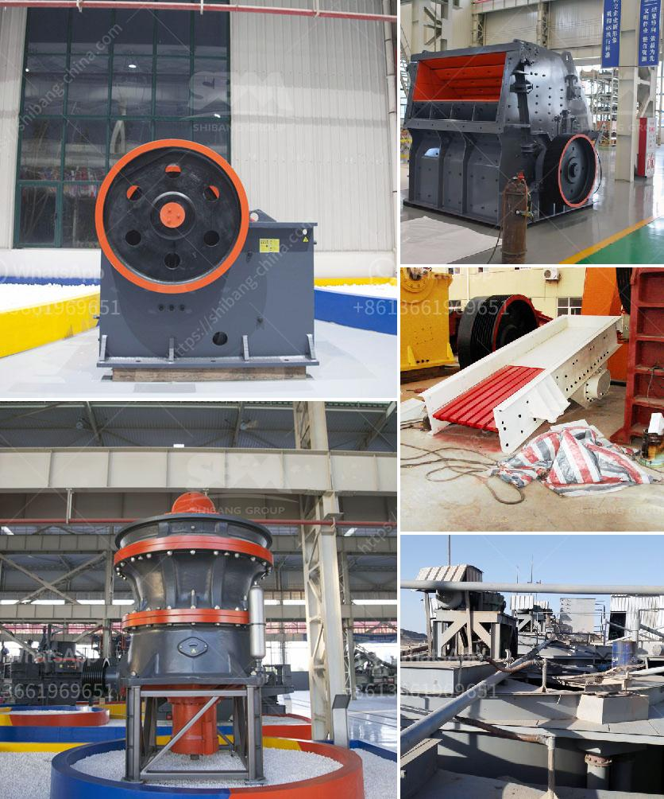

<h3>south africa manufacturer of mobile gold processing plant</h3>
South Africa is well-known for its rich mineral and resource wealth, particularly its gold reserves. With a long history of gold mining, the nation has developed advanced technology and expertise in the processing and extraction of gold. One important player in this sector is the manufacturer of mobile gold processing plants.

Mobile gold processing plants are self-contained, fully operational, and easily transportable processing plants for small-scale mining operations, pilot plants, or exploration projects. These plants consist of several modules, including crushing, grinding, gravity concentration, leaching, and carbon adsorption. The plants are designed to process gold-bearing ore efficiently and economically, maximizing gold recovery and minimizing environmental impact.

In South Africa, there are a few manufacturers specializing in mobile gold processing plants, providing the necessary equipment and expertise to effectively process gold ore. These manufacturers understand the unique challenges faced by small-scale miners and have developed solutions tailored to their specific needs.

One such manufacturer is ABC Mining Equipment (Pty) Ltd, based in Johannesburg. With years of experience in the mining industry, ABC Mining Equipment has gained a strong reputation for manufacturing high-quality mobile gold processing plants. Their plants are designed to be durable, reliable, and easy to operate, even in remote locations.

Another prominent manufacturer is XYZ Technologies (Pty) Ltd, based in Cape Town. XYZ Technologies focuses on providing innovative solutions for small-scale mining operations, including mobile gold processing plants. Their plants boast advanced technology and automation features, allowing for efficient and cost-effective processing of gold ore.

The mobile gold processing plants manufactured in South Africa are highly regarded not only locally but also internationally. These plants adhere to strict quality standards and are exported to various countries where small-scale gold mining is prevalent. The plants have proven to be valuable assets for local communities, providing job opportunities and economic growth.

The advantages of mobile gold processing plants go beyond their mobility and adaptability. These plants are designed to minimize environmental impact through efficient water and energy usage. Additionally, they are equipped with advanced control systems that ensure optimal performance and safety.

Despite the numerous advantages, mobile gold processing plants face certain challenges. The remote and often hazardous locations where small-scale mining occurs can make transportation and installation difficult. Furthermore, there may be a lack of infrastructure and skilled personnel in these areas. However, manufacturers work closely with their clients to overcome these challenges, providing comprehensive support and training.

In conclusion, South Africa is a leading manufacturer of mobile gold processing plants, catering to the needs of small-scale miners globally. These plants offer efficient and cost-effective solutions for gold extraction and processing, while adhering to strict quality and environmental standards. With continuous innovation and technological advancements, these manufacturers play a crucial role in supporting sustainable and responsible mining practices.
<h3>Contact us</h3><ul><li><strong>Whatsapp:&nbsp;<a href="https://wa.me/8613661969651">+8613661969651</a></strong></li><li><a href="https://swt.shibang-china.com/?git&amp;zhl&amp;south africa manufacturer of mobile gold processing plant"><strong>Online Service(chat now)</strong></a></li></ul><h3>Related</h3><ul><li><a href='price of stone crusher from china.md'>price of stone crusher from china</a></li><li><a href='cost required for mini cement plant.md'>cost required for mini cement plant</a></li><li><a href='chrome beneficiation plant design.md'>chrome beneficiation plant design</a></li><li><a href='crusher machine bottlecrusher machine bottles.md'>crusher machine bottlecrusher machine bottles</a></li><li><a href='vibrating vibrating grizzly feeder capacity.md'>vibrating vibrating grizzly feeder capacity</a></li></ul>