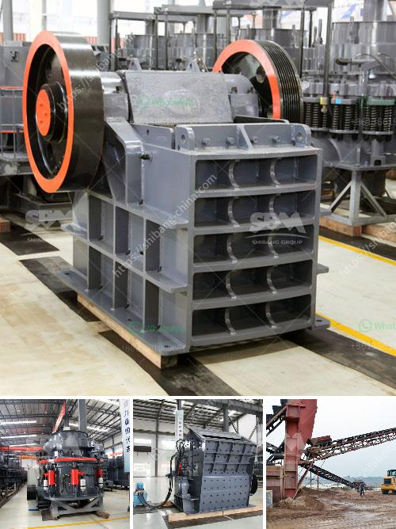

<h3>south africa mobile crusher</h3>
South Africa is experiencing a mobile crusher revolution. In recent years, the demand for efficient and technologically advanced mobile crushers has been steadily increasing. This trend is mainly driven by the construction and mining industries, where large stones and rocks need to be crushed into smaller pieces for further processing.

Mobile crushers are the modern solution to crushing and screening challenges in South Africa. They are designed to simplify the process of crushing materials, making it faster, more efficient, and cost-effective. With mobile crushers, contractors and miners can easily move their operations from one site to another, reducing the need for multiple transportations.

One of the key benefits of mobile crushers is their ability to crush a wide range of materials, including concrete, asphalt, and natural stones. This versatility allows contractors to produce different types of aggregates, which can be used for various construction purposes. Additionally, mobile crushers are equipped with advanced features such as remote control, GPS tracking, and real-time monitoring, making them incredibly user-friendly and safe to operate.

Another advantage of mobile crushers in South Africa is their lower operating costs compared to traditional stationary crushers. Mobile crushers consume less fuel and require minimal maintenance, reducing the overall operational expenses. Additionally, mobile crushers are usually equipped with efficient engines, which further contribute to fuel savings.

The rise of mobile crushers in South Africa has also had a positive impact on employment opportunities. The increasing demand for these machines has led to the creation of new jobs in the manufacturing, maintenance, and operation sectors. This translates into economic growth and creates opportunities for skilled workers in the country.

In conclusion, South Africa is witnessing a mobile crusher revolution that is transforming the way stones and rocks are crushed for construction and mining purposes. The introduction of mobile crushers has improved productivity, reduced costs, and created employment opportunities. As the demand for mobile crushers continues to rise, South Africa will remain at the forefront of this technological advancement in the crushing industry.
<h3>Contact us</h3><ul><li><strong>Whatsapp:&nbsp;<a href="https://wa.me/8613661969651">+8613661969651</a></strong></li><li><a href="https://swt.shibang-china.com/?git&amp;zhl&amp;south africa mobile crusher"><strong>Online Service(chat now)</strong></a></li></ul><h3>Related</h3><ul><li><a href='3tph ball mill for gold ore processing.md'>3tph ball mill for gold ore processing</a></li><li><a href='modeling clay process plant.md'>modeling clay process plant</a></li><li><a href='sand making machine suppliers in coimbatore.md'>sand making machine suppliers in coimbatore</a></li><li><a href='quartz crusher plant manufacturers in india.md'>quartz crusher plant manufacturers in india</a></li><li><a href='limestone crusher plant tph.md'>limestone crusher plant tph</a></li></ul>