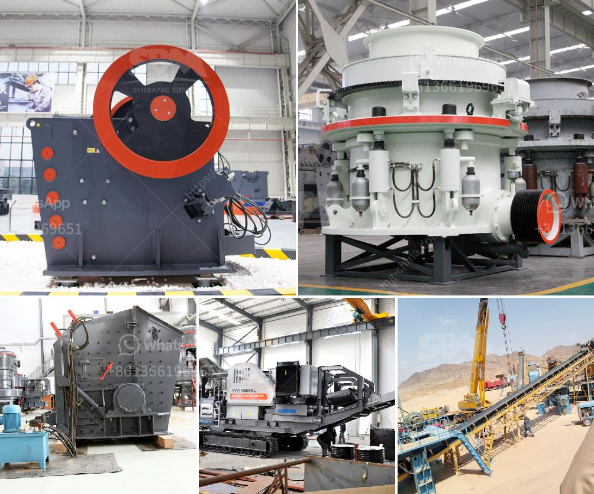

<h3>standard conveyor belts</h3>
Conveyor belts have been an integral part of industries for decades, revolutionizing material handling and improving efficiency across various sectors. Among the different types available, standard conveyor belts are a reliable option used extensively in industries worldwide. Whether it is manufacturing, mining, food processing, or logistics, these belts play a crucial role in streamlining operations and maximizing productivity.

Standard conveyor belts are designed to transport goods and materials, minimizing manual handling and reducing the risk of injuries. They consist of a belt made from various materials, such as rubber, PVC, or neoprene, supported by rotating pulleys at both ends. These belts are typically powered by electric motors, which facilitate continuous movement and enable the transportation of heavy loads over long distances.

One of the key advantages of standard conveyor belts is their versatility. They can handle a wide range of materials, including bulk goods, packaged items, and even hazardous substances. The design of the belt can be customized based on specific requirements, such as the width, length, and thickness, ensuring seamless integration into existing processes. Additionally, they can be configured in various angles and inclines to adapt to the layout and structure of the facility.

Safety is a crucial aspect of any industrial operation, and standard conveyor belts are designed with this in mind. They are equipped with features like emergency stop buttons, safety guards, and sensors to detect any anomalies or obstructions in the system. These safety mechanisms help in preventing accidents, minimizing downtime, and ensuring the well-being of the workforce.

Standard conveyor belts deliver significant benefits when it comes to improving efficiency and productivity. By automating material transportation, they eliminate the need for manual labor, reducing the chances of human errors and increasing operational speed. Consistent and reliable movement of materials allows for better inventory management, smoother production flows, and faster order fulfillment. Consequently, organizations can optimize their processes, decrease lead times, and meet customer demands effectively.

Alongside enhancing efficiency, standard conveyor belts contribute to cost savings. By reducing labor requirements, businesses can allocate resources more effectively, optimizing their workforce for higher-value tasks. Furthermore, these belts have low maintenance requirements and boast a long lifespan, resulting in decreased downtime and repair costs.

The ever-evolving technological advancements have also impacted standard conveyor belts. Today, manufacturers integrate cutting-edge technologies to further enhance their functionality. These include automated loading and unloading systems, barcode scanners, and intelligent control systems, enabling seamless integration with other components of the supply chain.

In conclusion, standard conveyor belts have revolutionized material handling and continue to play a pivotal role in various industries. Their versatility, safety mechanisms, and efficiency-enhancing features make them indispensable in modern-day operations. As industries continue to evolve, it is expected that the functionality and capabilities of conveyor belts will further improve, contributing to enhanced productivity and profitability.
<h3>Contact us</h3><ul><li><strong>Whatsapp:&nbsp;<a href="https://wa.me/8613661969651">+8613661969651</a></strong></li><li><a href="https://swt.shibang-china.com/?git&amp;zhl&amp;standard conveyor belts"><strong>Online Service(chat now)</strong></a></li></ul><h3>Related</h3><ul><li><a href='ballast crusher for sale in kenya.md'>ballast crusher for sale in kenya</a></li><li><a href='pulverized coal mill.md'>pulverized coal mill</a></li><li><a href='quarry crusher equipment supplier.md'>quarry crusher equipment supplier</a></li><li><a href='models of stone crushers in malaysia.md'>models of stone crushers in malaysia</a></li><li><a href='chain crusher chain crusher suppliers and.md'>chain crusher chain crusher suppliers and</a></li></ul>