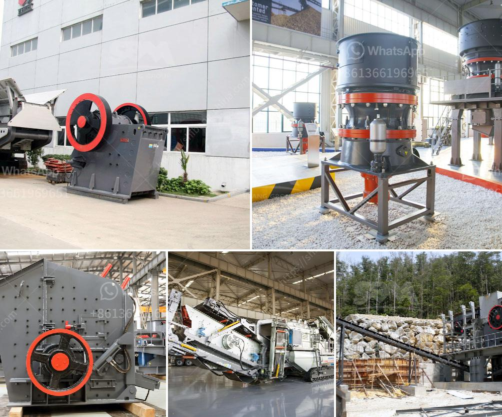

<h3>startup budget for a quarry business</h3>
Starting a quarry business can be a lucrative endeavor if done correctly. However, like any startup, careful planning and budgeting are essential for success. Whether you plan to extract and sell minerals or provide stone products for construction projects, having a well-defined budget can help you make informed decisions and effectively manage your finances. In this article, we will explore key factors to consider when creating a budget for your quarry business.

Before diving into budgeting, it is crucial to conduct thorough market research and a feasibility study. This will help you understand your target market, competition, potential customers, and the demand for your products. Evaluating the available resources, geological aspects, and permits required in your area will provide a solid foundation for your budgeting process.

Creating a comprehensive business plan is an indispensable step for any startup, including a quarry business. Your plan should outline your goals, objectives, mission, and vision for the company. It should also include market analysis, strategies for gaining a competitive edge, and sales forecasts. A well-defined business plan will guide your budgeting decisions and provide a roadmap for growth.

One of the critical elements of budgeting is forecasting revenue accurately. Review industry benchmarks and seek expert advice to estimate your potential sales volume and pricing strategy. Consider the price per tonne for extracted minerals or the cost of stone products you intend to produce. Understanding your revenue projections will help determine your operational and investment budgets effectively.

The operational budget encompasses day-to-day expenses required to run your quarry business. This includes employee wages, rent or lease expenses, utilities, machinery repair and maintenance, permits, insurance costs, and administrative overheads. Closely monitor your operational expenses to ensure smooth operations while optimizing profitability.

A startup quarry business requires investment in machinery, land, permits, and infrastructure. Plan your investment budget according to your business needs and specifications. Prioritize essential equipment like crushers, conveyors, loaders, and excavators, which would have a significant impact on your productivity. Plan your capital expenditure wisely to avoid any unnecessary financial burden.

Investing in marketing and advertising is crucial for promoting your quarry business and reaching potential customers. Allocate a portion of your budget to develop a professional website, create marketing collaterals, run online campaigns, and participate in industry-specific trade shows or conferences. Effective marketing efforts can help establish your brand and expand your customer base.

Setting aside a contingency fund is essential to cover unforeseen circumstances or emergencies that may arise during your quarry business operations. This fund acts as a safety net to cover unexpected costs, such as equipment breakdowns, natural disasters, or changes in regulations. Having a contingency reserve will prevent the need for excessive borrowing or jeopardizing the stability of your business.

In conclusion, building a startup budget for a quarry business involves careful consideration of various factors. Conduct thorough research, develop a comprehensive business plan, and accurately forecast revenue. Create operational and investment budgets, allocate funds for marketing efforts, and establish a contingency fund. By understanding and managing these aspects effectively, you can position your quarry business for long-term success.
<h3>Contact us</h3><ul><li><strong>Whatsapp:&nbsp;<a href="https://wa.me/8613661969651">+8613661969651</a></strong></li><li><a href="https://swt.shibang-china.com/?git&amp;zhl&amp;startup budget for a quarry business"><strong>Online Service(chat now)</strong></a></li></ul><h3>Related</h3><ul><li><a href='how to make powder red clay for glazes.md'>how to make powder red clay for glazes</a></li><li><a href='grinding mill machine in zimbabwe.md'>grinding mill machine in zimbabwe</a></li><li><a href='rock stone crushing machine in usa.md'>rock stone crushing machine in usa</a></li><li><a href='manganese ore mining processing process equipment.md'>manganese ore mining processing process equipment</a></li><li><a href='ball mill tons per hour capacity india.md'>ball mill tons per hour capacity india</a></li></ul>