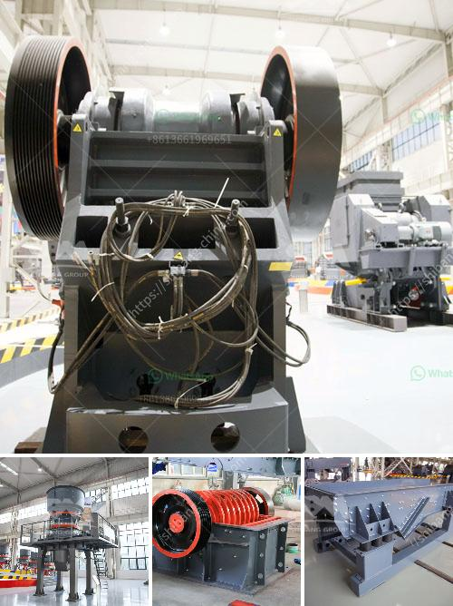

<h3>static jaw crusher for sale in south africa</h3>
Jaw crushers process medium to hard quarry rock or other materials by compressing it between the fixed jaw and the swing jaw. The swing jaw being the moving part is attached to a rotating eccentric shaft. The fixed jaw is an integral part of the crusher frame. Both jaws are fitted with manganese jaw liners that can be replaced or reversed when worn.

1. Large capacity and high reliability: The fixed jaw crusher has a proven track record in industrial applications due to its impressive performance. It has been widely used in mining, quarrying, and recycling industries.

2. Easy operation and maintenance: The static jaw crusher features a simple structure, easy to use and maintain. Its rugged construction ensures reliable operation even in the toughest conditions.

3. Cost-effective: Compared to other types of crushers, the static jaw crusher requires less capital investment and has lower operating costs, making it a cost-effective solution for crushing applications.

4. Versatile applications: The static jaw crusher can be used for various quarrying and mining applications, such as limestone, granite, ore, gold ore, copper ore, iron ore, and so on. It is widely used in primary crushing stages.

5. High-quality construction: The static jaw crusher is built to withstand the toughest conditions and materials. It is constructed with heavy-duty components and features a robust design, ensuring a long lifespan and reliable performance.

Jaw crushers south africa has a mature and vibrant market, especially the demand for stone crushers, crusher machines, and jaw crushers is very high. The Jaw Crusher Equipment is mainly used for a variety of ores and medium-grained bulk materials crushing, crushing compression strength not more than 320Mpa of various crusher equipment has been widely used in the major quarry resources in South Africa and crushing iron ore, coal, gold, manganese, and other materials.

In South Africa, static jaw crushers have attracted attention from various industries due to its perfect performance. Static jaw crusher for sale in South Africa is mainly used in mining, coal, quarrying, and recycling industries, ensuring a steady supply of high-quality materials for a variety of applications.

Due to its robust design, the static jaw crusher is easy and safe to operate and maintain. Compression crushers are used for primary and secondary rock crushing, and they are used for materials such as limestone, coal, granite, basalt, ore, gold ore, copper ore, iron ore, and so on.

In conclusion, the static jaw crusher for sale in South Africa is available from various manufacturers, and it is undoubtedly a reliable and cost-effective option for crushing applications. It is suitable for primary and secondary crushing of materials, and it is widely used in various industries due to its excellent performance. Whether for mining, quarrying, or recycling applications, the static jaw crusher is a reliable and durable solution that will enhance productivity and efficiency.
<h3>Contact us</h3><ul><li><strong>Whatsapp:&nbsp;<a href="https://wa.me/8613661969651">+8613661969651</a></strong></li><li><a href="https://swt.shibang-china.com/?git&amp;zhl&amp;static jaw crusher for sale in south africa"><strong>Online Service(chat now)</strong></a></li></ul><h3>Related</h3><ul><li><a href='industrial application of pebble mill.md'>industrial application of pebble mill</a></li><li><a href='iron processing equipment.md'>iron processing equipment</a></li><li><a href='sand washing plant saudi arabia.md'>sand washing plant saudi arabia</a></li><li><a href='industrial cone crusher.md'>industrial cone crusher</a></li><li><a href='method statement of installation conveyor belt.md'>method statement of installation conveyor belt</a></li></ul>