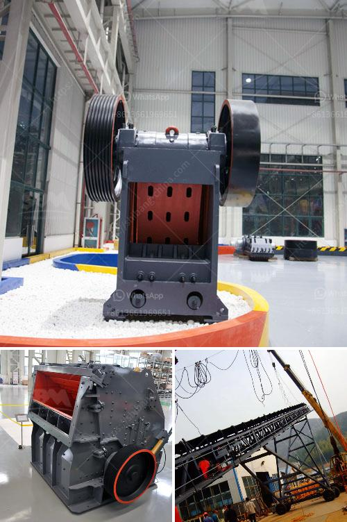

<h3>steel casting mining machinery parts wedge plate</h3>
In the challenging and demanding mining industry, the need for durable and reliable machinery is paramount. Mining operations require heavy machinery to efficiently extract and process valuable minerals, and any downtime can result in significant financial losses. One crucial component of mining machinery is the wedge plate, which plays a vital role in the equipment's performance and operational efficiency. This article explores the significance of steel casting wedge plates in mining machinery and their key benefits.

Wedge plates are critical components in mining machinery, where they serve as a form of anchor or support for various elements such as crushers, screens, and milling equipment. Their primary function is to secure or fasten different parts together, ensuring stability during operation. These plates are typically made from steel casting due to the material's exceptional strength, durability, and resistance to wear and tear.

One of the most significant advantages of steel casting wedge plates is their ability to withstand the demanding conditions of mining operations. The mining industry often exposes machinery to harsh environments, including dust, debris, high temperatures, and heavy loads. The robust nature of steel casting ensures that wedge plates can endure these harsh conditions without compromising their functionality. This not only extends the lifespan of the machinery but also minimizes the risk of unexpected breakdowns, which can be costly and time-consuming to repair.

Furthermore, steel casting wedge plates provide exceptional load-bearing capabilities. Mining machinery is subject to immense pressure and force, particularly during the extraction and crushing processes. Wedge plates made from steel casting exhibit high tensile strength, making them capable of handling considerable loads without deformation. By effectively distributing the load across different components, these plates contribute to the efficient and safe operation of mining machinery.

Another indispensable feature of steel casting wedge plates is their dimensional accuracy and precision. Mining machinery relies on the precise alignment of various parts to function optimally. Any misalignment or discrepancy can lead to reduced efficiency, increased energy consumption, and accelerated wear and tear. By using steel casting for wedge plates, manufacturers can ensure the exact dimensions required, thereby guaranteeing a perfect fit and alignment within the machinery. This precision leads to increased productivity, decreased downtime, and improved overall performance.

Additionally, steel casting offers excellent resistance to corrosion and abrasion. Mining operations often expose machinery to acidic or chemically reactive substances, as well as abrasive materials. By utilizing steel casting for wedge plates, manufacturers can provide a protective barrier against these corrosive agents, prolonging the lifespan of the machinery and reducing maintenance costs. Moreover, the resistance to abrasion ensures that wedge plates retain their shape and integrity, even when exposed to continuous wear and tear.

In conclusion, steel casting wedge plates are crucial components in mining machinery, playing a pivotal role in ensuring optimum performance and operational efficiency. Their exceptional strength, durability, load-bearing capabilities, dimensional accuracy, and resistance to corrosion and abrasion make them an ideal choice for the demanding conditions of the mining industry. Investing in high-quality steel casting wedge plates not only maximizes the lifespan of mining machinery but also minimizes downtime and maintenance costs. With these benefits, mining operations can run smoothly, efficiently, and profitably.
<h3>Contact us</h3><ul><li><strong>Whatsapp:&nbsp;<a href="https://wa.me/8613661969651">+8613661969651</a></strong></li><li><a href="https://swt.shibang-china.com/?git&amp;zhl&amp;steel casting mining machinery parts wedge plate"><strong>Online Service(chat now)</strong></a></li></ul><h3>Related</h3><ul><li><a href='mobile crusher machine.md'>mobile crusher machine</a></li><li><a href='difference between a hammer crusher and a hammer mill.md'>difference between a hammer crusher and a hammer mill</a></li><li><a href='mobile crusher plant south africa.md'>mobile crusher plant south africa</a></li><li><a href='drywall grinding for gypsum.md'>drywall grinding for gypsum</a></li><li><a href='chrome ore crushers and screeners for hire in south africa.md'>chrome ore crushers and screeners for hire in south africa</a></li></ul>