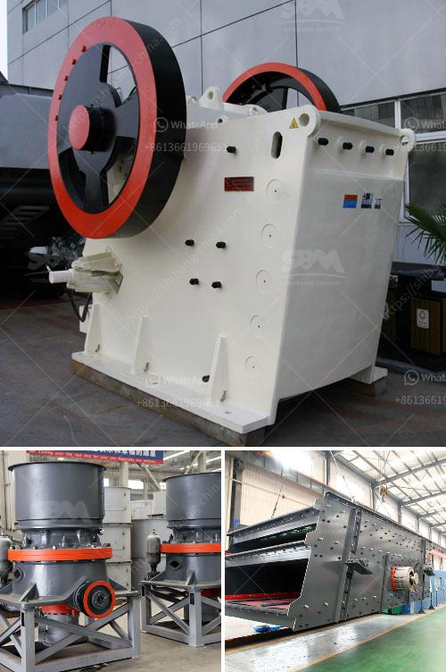

<h3>steel rolling mill project cost in india</h3>
Steel rolling mills are an essential component of the iron and steel industry in India, contributing to the growth and development of the country. With India being one of the fastest-growing economies globally, there is a high demand for steel products, which has led to the increase in the number of steel rolling mills in the country.

Establishing a steel rolling mill in India requires significant investment and planning. The project cost would vary depending on factors such as production capacity, size of the mill, machinery, and equipment, raw material requirements, and labor costs. Additionally, costs associated with land acquisition, permissions, licenses, and other regulatory requirements need to be considered.

On average, setting up a steel rolling mill in India could cost anywhere between INR 10 crores to INR 50 crores (equivalent to approximately USD 1.4 million to USD 7 million). The cost of the project can vary based on the specific requirements and scale of operations.

The initial investment would typically include land and infrastructure development, plant and machinery procurement, and working capital for the initial phase of production. Machinery and equipment required for a steel rolling mill include furnace, reheating furnace, roughing mill, finishing mill, and other auxiliary equipment. The cost of these components could range from a few lakhs to several crores depending on their capacity and quality.

Apart from the capital investment, ongoing operational costs such as raw material procurement, energy consumption, maintenance, and labor, need to be considered. While labor costs in India are relatively low compared to other countries, it is essential to factor in skilled and experienced personnel who can operate and maintain the rolling mill efficiently.

In conclusion, setting up a steel rolling mill in India involves substantial investment and careful planning. The project cost can range from INR 10 crores to INR 50 crores depending on various factors. However, with the growing demand for steel products and the government's focus on infrastructure development, a well-executed steel rolling mill project in India can be a highly profitable venture.
<h3>Contact us</h3><ul><li><strong>Whatsapp:&nbsp;<a href="https://wa.me/8613661969651">+8613661969651</a></strong></li><li><a href="https://swt.shibang-china.com/?git&amp;zhl&amp;steel rolling mill project cost in india"><strong>Online Service(chat now)</strong></a></li></ul><h3>Related</h3><ul><li><a href='quartz stone machine.md'>quartz stone machine</a></li><li><a href='conveyor belt indonesia.md'>conveyor belt indonesia</a></li><li><a href='crushing complete crushing plant 150tph 200tph.md'>crushing complete crushing plant 150tph 200tph</a></li><li><a href='100tph stone crusher sale in south africa.md'>100tph stone crusher sale in south africa</a></li><li><a href='grinding machine for making fine powder.md'>grinding machine for making fine powder</a></li></ul>