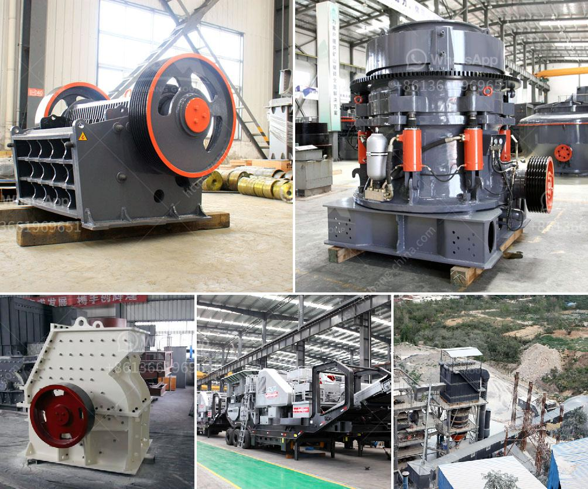

<h3>stone benta stone crusher in parral chihuahua</h3>
In recent years, the construction industry in Parral, Chihuahua has experienced a significant growth, attracting numerous infrastructure projects. With this rapid development, the need for innovative and efficient equipment has become crucial. One such innovation that has been making waves in the construction industry is the Stone Benta Stone Crusher.

The Stone Benta Stone Crusher is a revolutionary machine that aids in the crushing of stones, reducing their sizes efficiently. Unlike traditional crushers, this innovative solution does not require extensive manpower or exertion. Its advanced technology and design make it easy for operators to handle and maintain, saving both time and energy.

This machine plays a vital role in the construction industry as it turns large rocks and stones into smaller, manageable sizes. These smaller stones are then used in various construction activities such as road building, concrete production, and infrastructure development. The Stone Benta Stone Crusher has proven to be an essential asset in enabling a more efficient and cost-effective construction process.

One of the key advantages of the Stone Benta Stone Crusher is its mobility. This crusher can be easily transported to different construction sites, reducing the need for multiple machinery investments. It is also equipped with a powerful engine that enables it to crush stones with ease, cutting down on the time required for the completion of construction projects. Additionally, its compact size allows it to be easily maneuvered in tight spaces, making it suitable for urban construction projects as well.

Furthermore, the Stone Benta Stone Crusher is designed to be environmentally friendly. Its emission control system ensures that the machine meets all the required environmental regulations. This not only reduces its impact on the environment but also makes it a sustainable choice for construction companies.

Another outstanding feature of the Stone Benta Stone Crusher is its durability. Constructed with high-quality materials, this machine is built to withstand even the toughest conditions. Its robust design ensures that it can withstand heavy workloads, making it a long-term investment for construction companies.

In addition to its impressive performance, the Stone Benta Stone Crusher also offers excellent cost-saving benefits. With this machine, construction companies can reduce their costs by minimizing the need for manual labor, as well as the requirement for multiple machines. The crusher's efficient operation and durability result in lower maintenance and repair costs, further adding to its cost-saving advantages.

The Stone Benta Stone Crusher has undoubtedly revolutionized the construction industry in Parral, Chihuahua. Its mobility, environmental friendliness, durability, and cost-saving benefits have made it a game-changer in the field. As the demand for construction projects continues to rise, this innovative machine will play a crucial role in meeting the industry's needs efficiently and sustainably.

In conclusion, the Stone Benta Stone Crusher offers a revolutionary solution to the construction industry in Parral, Chihuahua. With its advanced technology, mobility, and cost-saving benefits, this machine has become an indispensable asset for construction companies. As Parral continues to grow and develop, the Stone Benta Stone Crusher will continue to contribute to the efficient completion of infrastructure projects, further solidifying its place as a cornerstone of the construction industry in the region.
<h3>Contact us</h3><ul><li><strong>Whatsapp:&nbsp;<a href="https://wa.me/8613661969651">+8613661969651</a></strong></li><li><a href="https://swt.shibang-china.com/?git&amp;zhl&amp;stone benta stone crusher in parral chihuahua"><strong>Online Service(chat now)</strong></a></li></ul><h3>Related</h3><ul><li><a href='ball milling in bangalore.md'>ball milling in bangalore</a></li><li><a href='ball mill manufacturers china.md'>ball mill manufacturers china</a></li><li><a href='india jaw crusher of small capacity.md'>india jaw crusher of small capacity</a></li><li><a href='ball mills layout.md'>ball mills layout</a></li><li><a href='gold crusher for sale in brazil.md'>gold crusher for sale in brazil</a></li></ul>