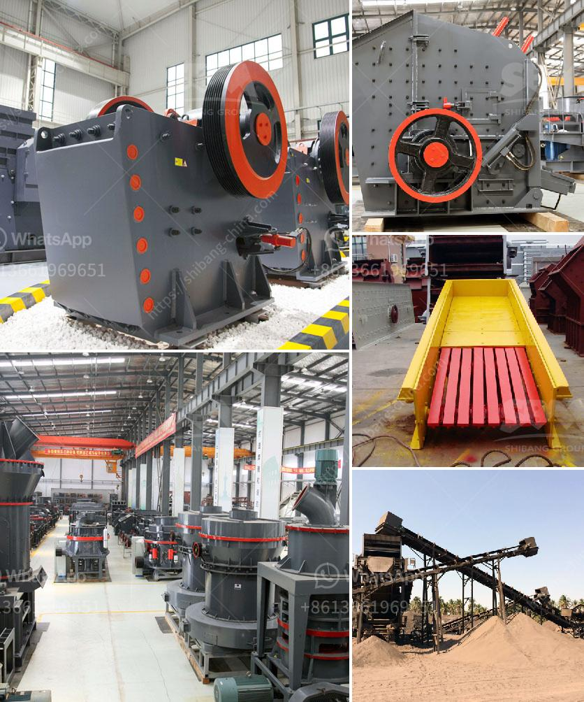

<h3>stone company profile in china</h3>
China is known for its rich cultural heritage, and one industry that has been thriving in the country for years is the stone industry. With a vast variety of natural stone resources available, China has become a leading global player in the production and export of stone products.

One prominent stone company in China is XYZ Stone Co., Ltd. Established in 1998, XYZ Stone Co., Ltd. has grown to become one of the largest stone manufacturers and exporters in the country. The company specializes in the extraction, processing, and distribution of various types of natural stone, including granite, marble, limestone, slate, and quartzite.

XYZ Stone Co., Ltd. boasts a state-of-the-art manufacturing facility equipped with advanced machinery and technology to ensure the highest quality standards are met. The company employs a team of skilled craftsmen and technicians who are well-versed in the art of stone processing. With their expertise, they are able to transform blocks of raw stone into exquisite finished products, such as kitchen countertops, bathroom vanities, flooring tiles, cladding, and monuments.

One of the key strengths of XYZ Stone Co., Ltd. is its strong commitment to quality. The company adheres to strict quality control measures at every stage of the production process, from sourcing raw materials to inspecting the finished products. XYZ Stone Co., Ltd. is dedicated to offering products that not only meet but exceed customer expectations.

In addition to its focus on quality, XYZ Stone Co., Ltd. also places great emphasis on sustainability and environmental responsibility. The company actively seeks out eco-friendly practices and implements them throughout its operations. From water recycling systems to dust control measures, XYZ Stone Co., Ltd. strives to minimize its environmental footprint and contribute to a greener future.

Over the years, XYZ Stone Co., Ltd. has established a global clientele and has successfully exported its products to more than 50 countries worldwide. The company's commitment to customer satisfaction has earned them a stellar reputation in the international stone market. Architects, designers, contractors, and homeowners alike trust XYZ Stone Co., Ltd. for their stone needs.

With its solid reputation, advanced manufacturing capabilities, and commitment to quality and sustainability, XYZ Stone Co., Ltd. continues to play a significant role in the growth and success of the stone industry in China. As the demand for natural stone products continues to rise both domestically and internationally, the company is poised for further expansion and success.

In conclusion, XYZ Stone Co., Ltd. is a leading stone company in China that has carved a niche for itself in the global stone market. With its focus on quality, sustainability, and customer satisfaction, the company stands out among its competitors. As China continues to be a major player in the stone industry, XYZ Stone Co., Ltd. remains at the forefront, representing the best of what the country has to offer in terms of natural stone products.
<h3>Contact us</h3><ul><li><strong>Whatsapp:&nbsp;<a href="https://wa.me/8613661969651">+8613661969651</a></strong></li><li><a href="https://swt.shibang-china.com/?git&amp;zhl&amp;stone company profile in china"><strong>Online Service(chat now)</strong></a></li></ul><h3>Related</h3><ul><li><a href='jaw crusher each equipment.md'>jaw crusher each equipment</a></li><li><a href='micronized quartz crusher plant.md'>micronized quartz crusher plant</a></li><li><a href='ball milling method in tamil.md'>ball milling method in tamil</a></li><li><a href='portable machine stone crusher machine for sale.md'>portable machine stone crusher machine for sale</a></li><li><a href='mobile crushing plant in peru.md'>mobile crushing plant in peru</a></li></ul>