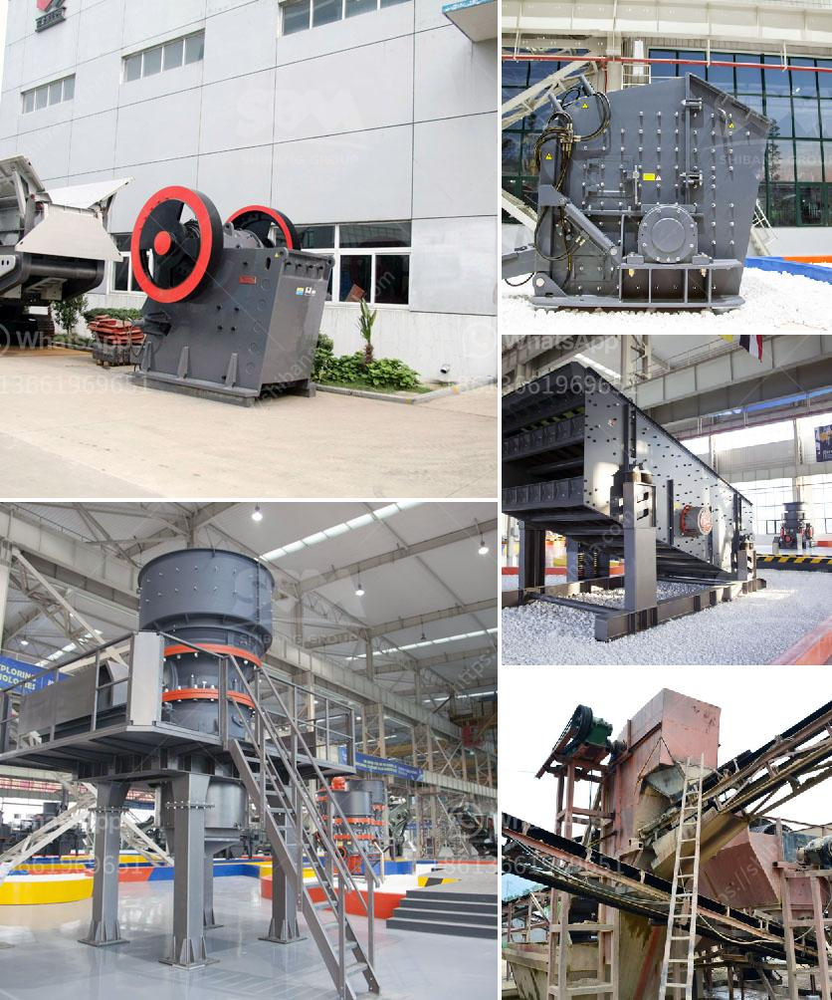

<h3>stone crusher 60 to 100 tonnes per hour</h3>
Stone crusher is a machine designed to reduce large rocks into smaller rocks, gravel, or rock dust. Crushers may be used to reduce the size, or change the form, of waste materials so they can be more easily disposed of or recycled, or to reduce the size of a solid mix of raw materials so that pieces of different composition can be differentiated. Crushing is the process of transferring a force amplified by mechanical advantage through a material made of molecules that bond together more strongly, and resist deformation more, than those in the material being crushed do.

Stone crushers are widely used in mining, metallurgy, building materials, highways, railways, water conservancy and chemical industries. And CHAENG is a famous foundry factory in Henan Province, which has rich experience in providing custom-made mechanical parts for the mining industry, building materials industry, metallurgical industry, construction industry and other fields.

Standardized quality management system ensures the high quality of stone crushers produced by CHAENG. Every product has passed ISO9001 quality certification, and the product quality is guaranteed. Largescale, high-quality and strong technical support from CHAENG can always provide customers with satisfactory products and services.

Stone crusher machines have become increasingly sophisticated and increasingly powerful over the years. While the market for artificial stones and sand products is in constant demand, the quality requirements are also increasingly stringent. The emergence of skills in the sand and gravel industry has promoted the development of the stone crusher industry. Competition in the industry has increased, but the industry has become increasingly orderly, and has become a sign of the development of the industry.

Stone crusher machines produced by CHAENG have long service life, low failure rate and convenient maintenance. The crushing ratio is large, the product size is uniform, the particle size of the crushed material can be strictly controlled, and the grain shape is excellent. It can meet the requirements of downstream users for the granularity of the end products, effectively reducing the loss of equipment and accessories. The economic benefits of users have been improved significantly.

In conclusion, stone crusher manufacturers should provide customers with high-quality equipment, advanced technology, perfect after-sales service to win praise and recognition of customers. Crushers are widely used in the mining, concrete recycling, and handling aggregates industries, and they are suitable for crushing various materials with compressive strength below 320MPa. The particle size of the crushed product is uniform and can be adjusted by the discharge port. It is a reliable, cost-effective, and efficient stone crushing equipment.
<h3>Contact us</h3><ul><li><strong>Whatsapp:&nbsp;<a href="https://wa.me/8613661969651">+8613661969651</a></strong></li><li><a href="https://swt.shibang-china.com/?git&amp;zhl&amp;stone crusher 60 to 100 tonnes per hour"><strong>Online Service(chat now)</strong></a></li></ul><h3>Related</h3><ul><li><a href='crusher plants for sale in south africa.md'>crusher plants for sale in south africa</a></li><li><a href='price phosphate rock crusher.md'>price phosphate rock crusher</a></li><li><a href='grinding marble stone price.md'>grinding marble stone price</a></li><li><a href='basalt curb stone crusher price.md'>basalt curb stone crusher price</a></li><li><a href='setting up of a stone quarry plant in nigeria.md'>setting up of a stone quarry plant in nigeria</a></li></ul>