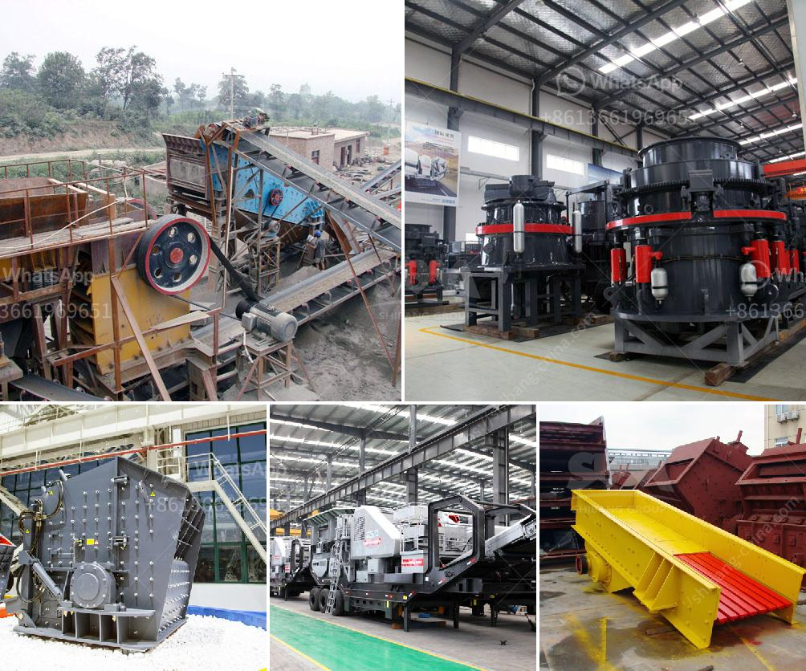

<h3>stone crusher application</h3>
Stone crusher, used for crushing various types of stones and rocks, such as limestone, granite, basalt, river pebbles, iron ore, etc., is an essential part of many industrial and construction projects. The high-quality stone crusher can conveniently crush materials for different purposes with a high efficiency, making it an ideal product in the market.

Stone crusher machines are widely used in mining, metallurgy, construction, highway, railway, water conservancy, and chemical industries. And it plays an important role in reducing the size of ore blocks, which increases the production efficiency and simplifies the crushing process.

The stone crusher applications include various mining activities, such as crushing large ore blocks extracted from the mines, crushing black stones, river pebbles, granite, limestone, and other naturally occurring stones. It is widely used in power plants, chemical plants, construction sites, sand and stone factories, and concrete batching plants.

Stone crushers have different specifications, including the type, capacity, feed size, output size, and so on. Different crushers have different crushing effects and processing capacities, making them suitable for various stone crushing applications. For example, jaw crushers are mainly used for coarse crushing, cone crushers and impact crushers are mainly used for medium crushing, and hammer crushers and roller crushers are commonly used for fine crushing.

In summary, a stone crusher machine is designed to be used to crush large stones into smaller pieces or even gravel size. In the construction and mining industries, it is essential for crushing various stones and rocks to make concrete, asphalt, and other building materials. Furthermore, stone crushers are designed for different applications based on their specifications, making them versatile machines that can be used in various industries.
<h3>Contact us</h3><ul><li><strong>Whatsapp:&nbsp;<a href="https://wa.me/8613661969651">+8613661969651</a></strong></li><li><a href="https://swt.shibang-china.com/?git&amp;zhl&amp;stone crusher application"><strong>Online Service(chat now)</strong></a></li></ul><h3>Related</h3><ul><li><a href='price hammer mill capacity of made in china.md'>price hammer mill capacity of made in china</a></li><li><a href='used marble machinery turkey.md'>used marble machinery turkey</a></li><li><a href='quarring of building stones crusher in pakistan.md'>quarring of building stones crusher in pakistan</a></li><li><a href='malaysia gravel crusher machine.md'>malaysia gravel crusher machine</a></li><li><a href='kaolin process flow diagram.md'>kaolin process flow diagram</a></li></ul>