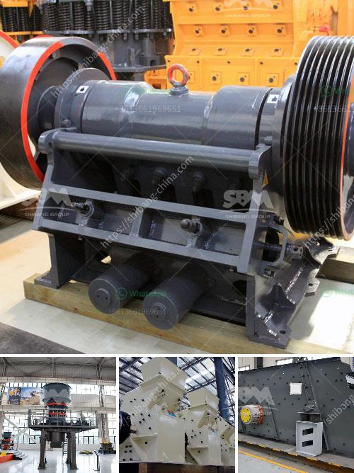

<h3>stone crusher equipment</h3>
Stone crusher equipment is widely used in various materials processing of mining &construction industries, such as crushing limestone, granite, basalt, cobblestone, etc. It is suitable for medium-sized crushing of ores and bulk materials. The equipment is mainly composed of a vibrating screen, jaw crusher, cone crusher, and impact crusher.

The crushing equipment has a wide range of applications in the market, and the equipment performance is stable and reliable. It has won the trust of customers and has a good market prospect.

The jaw crusher has a large crushing ratio, high output, and uniform product size. It is mainly used for coarse crushing of various materials. It is an essential equipment in the sand and gravel production line and ore processing line.

The cone crusher has strong crushing ability, low operation cost, and reliable performance. It is suitable for crushing various ores and rocks with medium and high hardness. It is widely used in metallurgy, construction, road construction, chemical engineering, and silicate industries.

The impact crusher has the advantages of large crushing ratio, high crushing efficiency, low power consumption, easy maintenance, and good particle shape of the finished product. It is widely used in the fields of construction, chemical industry, railway, mining, etc.

In addition to the above crushers, other equipment such as vibrating screens, feeders, and conveyors are also necessary for the stone crusher equipment to complete the crushing and screening process.

The stone crusher equipment is mainly used for crushing stone materials, and the finished product is used for construction, road construction, bridge construction, railway construction, industrial and mining applications, etc. It can be divided into primary, secondary, and fine crushing according to the different types of feeding and discharging granularity.

In conclusion, the stone crusher equipment is an essential equipment in the mining and construction industries. It has a wide range of applications and can meet the production needs of different industries. With the continuous advancement of technology, the equipment performance will continue to improve, providing more efficient and reliable equipment for customers.
<h3>Contact us</h3><ul><li><strong>Whatsapp:&nbsp;<a href="https://wa.me/8613661969651">+8613661969651</a></strong></li><li><a href="https://swt.shibang-china.com/?git&amp;zhl&amp;stone crusher equipment"><strong>Online Service(chat now)</strong></a></li></ul><h3>Related</h3><ul><li><a href='stone quarry machines.md'>stone quarry machines</a></li><li><a href='prices for sand washer on sale in india.md'>prices for sand washer on sale in india</a></li><li><a href='crusher sri lanka.md'>crusher sri lanka</a></li><li><a href='rental crusher rinda.md'>rental crusher rinda</a></li><li><a href='marbel grinding machine.md'>marbel grinding machine</a></li></ul>