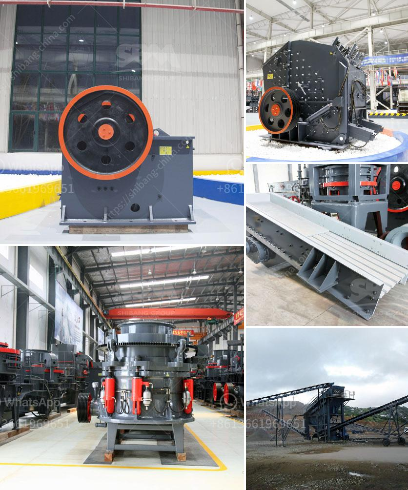

<h3>stone crusher for sale</h3>
Stone crusher is a machine used to crush rocks into smaller pieces, usually for gravel or some other road or building application. Most of the stone crushers have a hopper at the top to hold the stone material and a jaw or a cone to break it into pieces. Stone crushing equipment has become increasingly popular in recent years due to its powerful crushing capacity and lower operational costs.

When looking for a stone crusher for sale, one should consider a few important factors. Firstly, the crusher's production capacity is crucial to ensure that it can handle the desired output. Stone crushers are available in different sizes, ranging from small ones that are ideal for residential and small-scale construction projects to larger models suitable for industrial applications.

Another crucial aspect to consider is the type of material the crusher is designed to handle. Some stone crushers are specifically designed to crush softer materials like limestone, while others are suitable for crushing harder rocks like granite or basalt. Choosing the right crusher that can handle the specific material is essential for efficient and effective crushing.

Additionally, it is important to assess the crusher's power source. While some stone crushers are powered by electricity, others are powered by diesel engines or even a combination of both. The power source should be chosen based on the availability of electricity and the specific needs of the project. Electric-powered crushers are often more energy-efficient and environmentally friendly, while diesel-powered ones are more suitable for remote locations without access to electricity.

Finally, it is vital to consider the maintenance and operational costs associated with a stone crusher. Regular maintenance is crucial to ensure the crusher's longevity and reliable performance. It is advisable to purchase a stone crusher from a reputable manufacturer who provides excellent after-sales support, spare parts availability, and service assistance.

In conclusion, finding the right stone crusher for sale requires careful consideration of factors such as production capacity, material type, power source, and maintenance costs. By investing in a reliable and efficient stone crusher, individuals and businesses can benefit from having a powerful crushing capability and reduced operational expenses.
<h3>Contact us</h3><ul><li><strong>Whatsapp:&nbsp;<a href="https://wa.me/8613661969651">+8613661969651</a></strong></li><li><a href="https://swt.shibang-china.com/?git&amp;zhl&amp;stone crusher for sale"><strong>Online Service(chat now)</strong></a></li></ul><h3>Related</h3><ul><li><a href='principle of roller mill.md'>principle of roller mill</a></li><li><a href='stone crusher germany.md'>stone crusher germany</a></li><li><a href='sand and gravel exploration equipment.md'>sand and gravel exploration equipment</a></li><li><a href='crossley economy x ball mill.md'>crossley economy x ball mill</a></li><li><a href='jaw crusher size.md'>jaw crusher size</a></li></ul>