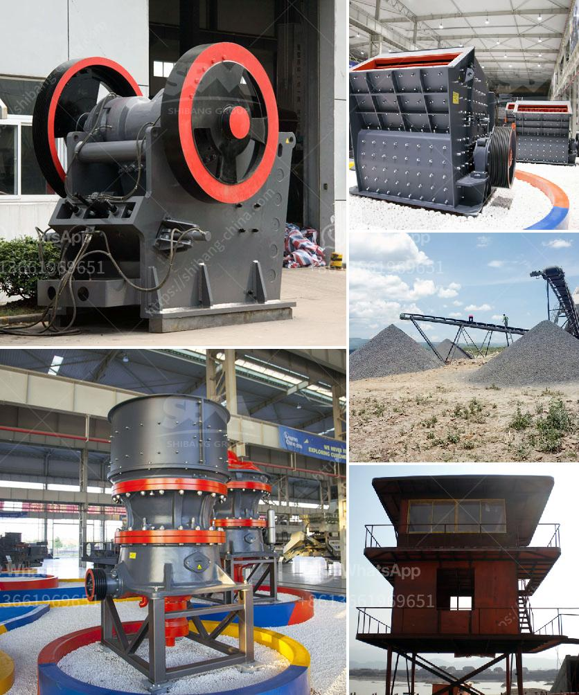

<h3>stone crusher german company</h3>
Many people are fascinated by the concept of stone crushers, but few understand the significance of the German-made stone crushing machine, as they tend to underestimate the power of technology in all manner of industries. Fortunately, such individuals can now learn more about this fairly popular company.

The German company, whose name is not disclosed in this article for business ethical reasons, is one of the leading manufacturers of stone crusher machines in Germany. They cater to the different demands of the industrial world with their extensive range of machinery for various purposes. From stone crushing to mining, they have it all!

With a strong foundation in the art of engineering, this company understands the intricacies of machine design and how to deliver superior quality products to their customers. The stone crusher machines offered by the German company are built to cater to the demanding conditions found in the mining and construction industries. These machines are known for their robustness, efficiency, and versatility.

One of the key features of the stone crusher machines from this German company is their powerful engines. These engines provide the necessary power to crush stones of varying sizes with great ease. Whether it is limestone, granite, or any other type of stone, these machines can crush them all. The advanced engine technology ensures that the machines can perform efficiently and effectively, even in the most challenging conditions.

In addition to their powerful engines, these stone crusher machines also boast other impressive features. They are designed with the latest technology, making them easy to operate, maintain, and repair. This ensures that operators can maximize their productivity and minimize downtime. The German company’s commitment to quality is evident through the incorporation of durable and reliable components in their machines.

Another factor that sets this German company apart from its competitors is its commitment to customer satisfaction. They take great pride in offering exceptional customer service and support, which is why their machines are regarded as the best in the industry. With a strong focus on innovation, they continuously strive to develop new and improved machines that meet the evolving needs of their customers.

Whether one needs a stone crusher machine for a small-scale project or a large mining operation, the German company has the perfect solution. Their extensive range of stone crusher machines ensures that customers can find the ideal machine for their specific requirements. Furthermore, they offer customized solutions to address unique challenges faced by their clients.

To conclude, the stone crusher machines manufactured by this German company are renowned worldwide for their reliability, efficiency, and versatility. They are the perfect solution for anyone in need of crushing stones for construction or mining purposes. With their powerful engines, advanced technology, and commitment to quality, the German company sets the benchmark for stone crusher machines in the industry. Whether it is a small-scale project or a large-scale mining operation, these machines are equipped to deliver exceptional performance and unparalleled durability.
<h3>Contact us</h3><ul><li><strong>Whatsapp:&nbsp;<a href="https://wa.me/8613661969651">+8613661969651</a></strong></li><li><a href="https://swt.shibang-china.com/?git&amp;zhl&amp;stone crusher german company"><strong>Online Service(chat now)</strong></a></li></ul><h3>Related</h3><ul><li><a href='write an article about cube crushing machine for concrete with 100300 words.md'>write an article about cube crushing machine for concrete with 100-300 words</a></li><li><a href='chrome mining equipment and machinery.md'>chrome mining equipment and machinery</a></li><li><a href='stone mining crusher in jharkhand.md'>stone mining crusher in jharkhand</a></li><li><a href='manufacturing company for ball mill.md'>manufacturing company for ball mill</a></li><li><a href='bauxite processing plant in taitata.md'>bauxite processing plant in taitata</a></li></ul>