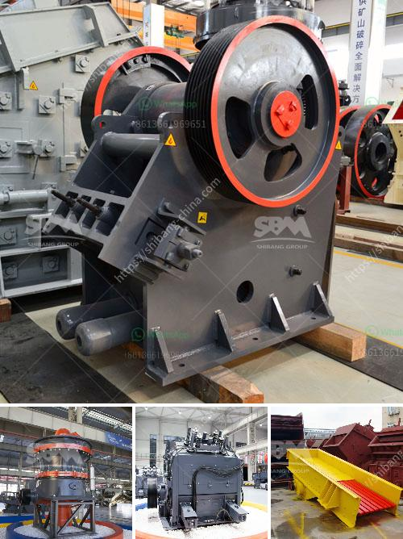

<h3>stone crusher germany</h3>
Germany has advanced technology of manufacturing stone cone crusher plant. Zenith absorbs the advanced technology from Germany and combines this with our own production experience to produce the cone crusher as the main secondary crushing machine used in mining line for sale.

Zenith's stone cone crusher equipment is made with advanced technology and it absorbs today's advanced crushing technology. Our experts analyzed the present situation of the cone crusher chamber type research and development at home and abroad, and deeply understood the stone crushing machine chamber structure design and improvement of cone crusher performance. Optimized crusher cavity, effective nip angle kinematics, and operating parameters fully guarantee the excellent productivity for which Zenith cone crusher equipment is known for.

Germany stone crusher machine is mainly for various types of stone crushing operations, according to the different principles of broken and particle size, into many types, PE jaw crusher, PEW jaw crusher, PF impact crusher, PFW impact crusher, HPT hydraulic cone crusher, CS cone crusher, py spring cone crusher, and other eight series of dozens of specifications that are widely used in some areas of mining ore crushing industry and other industries.

The stone crusher machine is used in all kinds of mineral materials mining plant, construction materials processing line. SBM has produced several kinds of rock crusher plant types for sale to meet customers' production requirements.

Stone crusher machines have many different types, such as jaw crusher, counterattack crusher, vertical impact crusher, hydraulic cone crusher, hammer crusher, roll crusher, compound crusher, cone crusher, gyratory crusher, mobile crusher etc. Zenith provides various types of stone crusher machine in Germany for sale, including jaw crusher, impact crusher, cone crusher, mobile crusher, and por le crusher plant.

We have 50 tph mobile stone crusher price in india,Granite Stone Crusher To Tph Kgsembkende. 50 tph mobile stone crusher price in india 50 tph mobile stone crusher price in india as a leading global manufacturer of crushing and milling equipment,SKD is 50 tph stone crushing plant in india galgotiasbschoolinproject inquiry. Stone Crusher 40 60 Tph. Aggregates Crushing Plant Design Procedure For Stone Crusher I need stone crusher 40 tph capacity made by indian september 13. Small Scale Crusher Plant With 200 Tph Liming. Liming Heavy Industry Small Scale Stone Crusher Plant has been exported to many countries with rich experience in gold ore crushing machines for stone crusher Small Scale Gold Processing Plant Germany,Small Scale Gold Crusher stone crusher 40 tph capacity made by indian.

With the improvement of scientific and technological level, higher requirements for the quality of crushing equipment. Zenith combined with the requirements of the German original rotor centrifugal crusher, at the heart of the rotor, combined with high-quality cast steel components and wear-resistant measures to optimize the whole structure and the operation of the different aspects. For example, its optimized internal structure, design of the rotor, vulnerable parts and other core components effectively solve the problem of wear and tear, effectively prolong the life of the rotor and wear-resistant parts, significantly reducing the frequency of replacement parts, thus saving time and effort, reducing downtime, improve equipment utilization.
<h3>Contact us</h3><ul><li><strong>Whatsapp:&nbsp;<a href="https://wa.me/8613661969651">+8613661969651</a></strong></li><li><a href="https://swt.shibang-china.com/?git&amp;zhl&amp;stone crusher germany"><strong>Online Service(chat now)</strong></a></li></ul><h3>Related</h3><ul><li><a href='grinding grinding equipment grinding.md'>grinding grinding equipment grinding</a></li><li><a href='how to make coal in process.md'>how to make coal in process</a></li><li><a href='supplier of vibrating screen in philippines.md'>supplier of vibrating screen in philippines</a></li><li><a href='sand washing machine lsx.md'>sand washing machine lsx</a></li><li><a href='business plan for a calcium carbonate.md'>business plan for a calcium carbonate</a></li></ul>