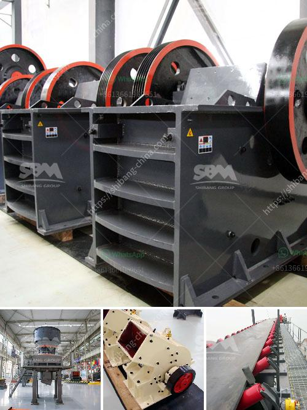

<h3>stone crusher hospital dhaka</h3>
Stone Crusher Hospital Dhaka is a renowned healthcare institution located in the heart of Bangladesh's capital, Dhaka. Established in the year 1983, this hospital has been serving the underprivileged community with utmost dedication and commitment for more than three decades.

The hospital was initially established as a small healthcare center, providing primary healthcare services to the impoverished population residing in and around Dhaka. Over the years, it has expanded its facilities and services to become a full-fledged hospital, equipped with state-of-the-art medical equipment and staffed by highly qualified doctors, nurses, and support staff.

One of the unique aspects of Stone Crusher Hospital Dhaka is its unwavering dedication to serving the underprivileged sections of society. The hospital is located in a densely populated area, predominantly inhabited by low-income families who struggle to afford quality healthcare services. Understanding the dire need for accessible healthcare in the community, the hospital has been providing subsidized or free medical treatments to patients in need.

The hospital offers a wide range of medical services across various specialties, including internal medicine, pediatrics, obstetrics and gynecology, surgery, orthopedics, cardiology, and radiology, to name a few. In addition to these, the hospital also runs several specialized clinics, such as diabetes clinics, hypertension clinics, and counseling services, to address the specific healthcare needs of the community.

Alongside its healthcare services, Stone Crusher Hospital Dhaka also actively engages in community outreach programs. These programs aim to create awareness about various health issues, promote preventive healthcare measures, and provide assistance to individuals with limited resources. The hospital organizes health camps and medical check-up drives in the surrounding areas, ensuring that the marginalized segments of society have access to basic healthcare facilities.

Stone Crusher Hospital Dhaka has earned a reputation for its excellent patient care and compassionate approach towards its patients. The hospital's staff ensures that every patient is treated with utmost respect, empathy, and dignity, irrespective of their socio-economic background. The hospital aims to create a welcoming and inclusive environment, making patients feel comfortable and cared for during their medical journey.

In recent years, Stone Crusher Hospital Dhaka has faced numerous challenges, including financial constraints and lack of resources. However, the hospital's commitment to its mission has remained undeterred. With the support of philanthropic individuals, charitable organizations, and the government, the hospital continues to provide quality healthcare services to those in need.

In conclusion, Stone Crusher Hospital Dhaka stands as a beacon of hope and a source of solace for the underprivileged population of Bangladesh. Its unwavering commitment to providing accessible and affordable healthcare services makes it an invaluable institution in the country's healthcare landscape. The hospital's dedication to serving the community and its emphasis on compassion and patient-centric care makes it a true symbol of healthcare excellence.
<h3>Contact us</h3><ul><li><strong>Whatsapp:&nbsp;<a href="https://wa.me/8613661969651">+8613661969651</a></strong></li><li><a href="https://swt.shibang-china.com/?git&amp;zhl&amp;stone crusher hospital dhaka"><strong>Online Service(chat now)</strong></a></li></ul><h3>Related</h3><ul><li><a href='malaysia stone crushing machine crusher for sale.md'>malaysia stone crushing machine crusher for sale</a></li><li><a href='smallfine powder grinding machine nigeria.md'>smallfine powder grinding machine nigeria</a></li><li><a href='mobile crushing and screening contractors south africa.md'>mobile crushing and screening contractors south africa</a></li><li><a href='price phosphate rock crusher.md'>price phosphate rock crusher</a></li><li><a href='quartz mining process.md'>quartz mining process</a></li></ul>