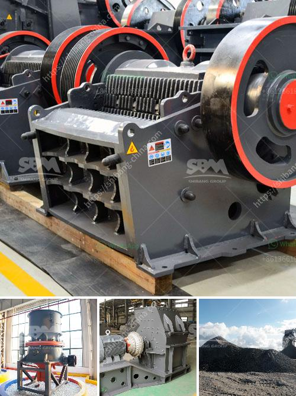

<h3>stone crusher in davao</h3>
Stone crushing industry is an important industrial sector in the country engaged in producing crushed stone of various sizes depending upon the requirement which acts as raw material for various construction activities such as construction of roads, highways, bridges, buildings, and canals.

Stone crushing is an integral part of construction industry and stone crusher in Davao plays an important role in processing stones into building aggregates. The cost of producing aggregates depends on the energy consumption and quality output. The research conducted by the Department of Science and Technology reveals that the energy consumption is primarily associated with the size reduction process during crushing. Thus, improving the crushing efficiency is of utmost importance for reducing energy consumption and production cost.

In Davao, there are abundant stone resources. However, due to rugged terrain and limited transportation infrastructure, it is often challenging to extract and transport these stones to the construction sites efficiently. This is where stone crushers play a pivotal role. They break down large stones into smaller sizes, making it easier to transport and utilize in construction projects.

Stone crushers are primarily small scale industries in Davao. They mainly operate on a labor-intensive basis involving manual stone crushing processes. Various types of crushers are used in the stone crushing industry such as jaw crushers, roller crushers, cone crushers, impactor, rotopoctor, etc. They are capable of producing different types of aggregate materials, such as sand, gravel, crushed stone, and recycled concrete.

Stone crushing industry in Davao has been growing rapidly due to increasing demand from the construction sector. This has resulted in a boost in the local economy and employment opportunities for the local population. The stone crushing industry also provides opportunities for income generation for small-scale entrepreneurs, such as stone crusher owners.

Aside from economic benefits, stone crushing also plays a crucial role in environmental conservation. Stone crushers in Davao are designed to minimize environmental pollution by utilizing eco-friendly technologies. These crushers employ dust suppression systems to prevent dust emissions that can cause air pollution and respiratory health issues. Moreover, some stone crushers are equipped with advanced water sprayers to control dust during the crushing process.

In conclusion, stone crushers in Davao contribute to the construction industry by breaking down large stones into smaller sizes, making it easier to transport and utilize. This improves efficiency and reduces production costs. Furthermore, stone crushing industry in Davao provides income-generating opportunities for small-scale entrepreneurs and supports economic development in the region. It also plays a vital role in environmental conservation by adopting eco-friendly technologies to minimize pollution. As the demand for construction materials continues to rise, the stone crushing industry will continue to thrive and contribute to the growth of Davao's economy.
<h3>Contact us</h3><ul><li><strong>Whatsapp:&nbsp;<a href="https://wa.me/8613661969651">+8613661969651</a></strong></li><li><a href="https://swt.shibang-china.com/?git&amp;zhl&amp;stone crusher in davao"><strong>Online Service(chat now)</strong></a></li></ul><h3>Related</h3><ul><li><a href='diagram of a hammer mill.md'>diagram of a hammer mill</a></li><li><a href='30 tons per hour cost.md'>30 tons per hour cost</a></li><li><a href='granite quarry business plan pdf.md'>granite quarry business plan pdf</a></li><li><a href='bentonite crushing manufacturing process.md'>bentonite crushing manufacturing process</a></li><li><a href='grinding of limestone crusher.md'>grinding of limestone crusher</a></li></ul>