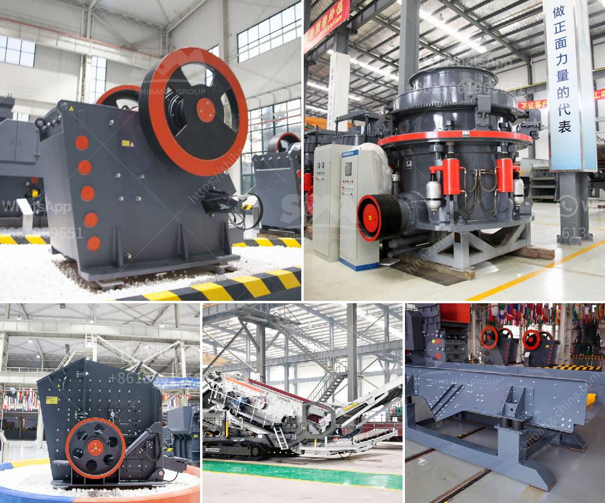

<h3>stone crusher in sri lanka</h3>
Stone crusher is a machine designed to reduce large rocks into smaller rocks, gravel, or rock dust. It is used in many industries, including mining, construction, and even recycling. In Sri Lanka, where the environment resources are rich and the lands are generally mountainous, stone crushers are needed. There are tens of thousands of stone crushers around the country, which contribute significantly to the economy.

The stone crusher industry in Sri Lanka has been growing rapidly due to increasing demand from the construction industry and the present government policies towards the usage of crushed stones for various development activities. The main product of stone crushers in Sri Lanka is crushed granite metal. This product is used as a construction material in dams, bridges, buildings, and even in railways.

The stone crushers in Sri Lanka are located in Colombo, Kandy, Anuradhapura, Kegalle, and Matara. These machines work round the clock, generating huge quantities of dust and noise. There is a need to minimize the impact of these stone crushers on the environment and the people living nearby. To address this issue, the government and the stone crusher operators are working together to come up with sustainable methods of operation.

In recent years, technology has played a crucial role in reducing the negative impact of stone crushers. Many stone crushers in Sri Lanka have adopted advanced dust control methods to minimize dust emissions, water sprinklers have also been installed to suppress the dust created during the crushing process. Furthermore, the usage of sound barriers and rubber buffers has reduced noise pollution caused by stone crushers.

Stone crushers in Sri Lanka not only produce a valuable material but also contribute to the economy by creating job opportunities. The stone crushing industry is an important source of income for numerous families in the country. In addition, they also contribute to the GDP through the taxes and levies imposed by the government.

In conclusion, the stone crusher industry in Sri Lanka is a profitable one which not only contributes to the economy but also paves the way for sustainable development. With advancements in technology and efforts of the government and the stone crusher operators, productivity has improved while the negative impact on the environment and the people living nearby has been minimized.
<h3>Contact us</h3><ul><li><strong>Whatsapp:&nbsp;<a href="https://wa.me/8613661969651">+8613661969651</a></strong></li><li><a href="https://swt.shibang-china.com/?git&amp;zhl&amp;stone crusher in sri lanka"><strong>Online Service(chat now)</strong></a></li></ul><h3>Related</h3><ul><li><a href='low cost jaw crusher for sale in ethiopia.md'>low cost jaw crusher for sale in ethiopia</a></li><li><a href='mobile crushing and screening.md'>mobile crushing and screening</a></li><li><a href='impact crusher machine.md'>impact crusher machine</a></li><li><a href='cost to setup mini cement plant in india.md'>cost to setup mini cement plant in india</a></li><li><a href='stone quarry equipment.md'>stone quarry equipment</a></li></ul>