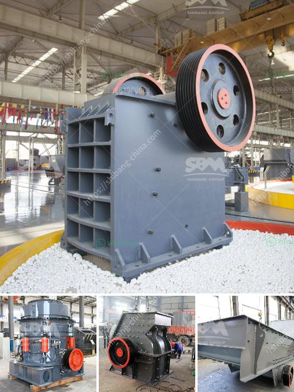

<h3>stone crusher in stone</h3>
Stone Crusher is a machine designed to reduce large rocks into smaller rocks, gravel, or rock dust. Crushers may be used to reduce the size, or change the form, of waste materials so they can be more easily disposed of or recycled, or to reduce the size of a solid mix of raw materials, so that pieces of different composition can be differentiated. Crushing is the process of transferring a force amplified by mechanical advantage through a material made of molecules that bond together more strongly, and resist deformation more, than those in the material being crushed do.

The earliest crushers were hand-held stones, where the weight of the stone provided a boost to muscle power, used against a stone anvil. Querns and mortars are types of these crushing devices. The cone crusher is invented on in 1898, it was not until the early 20th century that the cone crusher was further developed for use in the processing of materials. With the rapid development of mining technology, the cone crusher can be divided into various models according to the crushing chamber type: sloping surface cone crusher, broken pacing cone crusher and rolling acetabular wall cone crusher.

The stone crusher is widely used in mining, building materials, chemical industry, metallurgy and so on. The stone crusher is suitable for primary and secondary crushing all kinds of minerals and rocks with compressive strength less than 320 MPa. The stone crusher is with high crushing ratio, larger capacity, lower operation cost, etc. The structure is simple and rational, the operation is stable, and reliable; the maintenance is simple, and convenient and the operation cost is greatly reduced.

Model Feeding Opening Size (mm) Max. Feeding Size (mm) Adjustable Discharge Opening (mm) Capacity (t/h) Motor Power (kW) Weight (t) Overall Dimension (mm) 

Stone crusher is mainly used for crushing various medium-hard ores and bulk materials, such as iron ore, limestone, coal, granite, etc. Its purpose is to convert the ore obtained from the mine to a usable material like sand or gravel. Cone crushers are often used in medium and fine crushing operations, widely used in mining industry, metallurgy industry, construction industry, road construction industry, chemical industry and silicate industry, etc., suitable for crushing hard ore and rock.

In conclusion, stone crusher is a vital machine in stone production line. The rapid development of infrastructure will inevitably increase the demand for sand and gravel, ore and other basic raw materials. This stone crusher machinery is reliable and durable, making it easy to produce high-quality sand and aggregates for construction purposes worldwide.
<h3>Contact us</h3><ul><li><strong>Whatsapp:&nbsp;<a href="https://wa.me/8613661969651">+8613661969651</a></strong></li><li><a href="https://swt.shibang-china.com/?git&amp;zhl&amp;stone crusher in stone"><strong>Online Service(chat now)</strong></a></li></ul><h3>Related</h3><ul><li><a href='small cement plant for sale.md'>small cement plant for sale</a></li><li><a href='mobile aggregate crusher.md'>mobile aggregate crusher</a></li><li><a href='movable conveyor belt.md'>movable conveyor belt</a></li><li><a href='quarrying crusher in zimbia.md'>quarrying crusher in zimbia</a></li><li><a href='talc powder plant.md'>talc powder plant</a></li></ul>