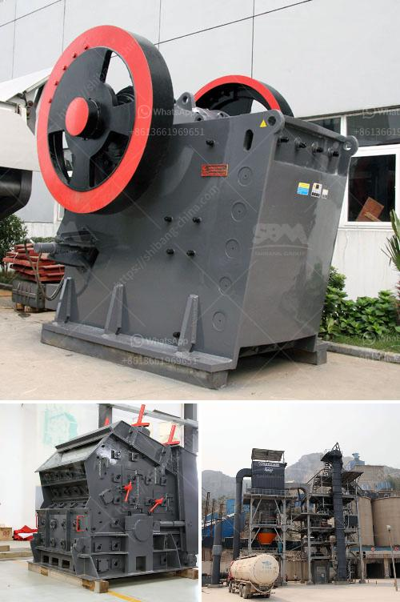

<h3>stone crusher indonesia dan jerman</h3>
Stone crusher is a machine designed to reduce large rocks into smaller rocks, gravel, or rock dust. Stone crusher is widely used in many sectors such as mining, smelting, building materials, roads, railways, water conservancy, and chemical industries.

The stone crushing market is huge and has been growing steadily over the past few years. In Indonesia, the growing population and rapid urbanization have resulted in an increasing number of infrastructure projects and housing needs. This has spurred the demand for stone crushers in the country.

The demand for stone crusher machines in Indonesia is skyrocketing due to various factors, such as the increasing urbanization, rapid infrastructure development, and industrialization. Furthermore, the stone quarrying and crushing industry plays a vital role in Indonesia’s economy.

There are two types of stone crusher machines in Indonesia. The first is a fixed stone crusher machine called as jaw crusher and the second is a mobile stone crusher machine called as crawler-type mobile crusher. Both machines can process rocks into smaller pieces.

The stone crushing industry in Indonesia is dominated by government-owned construction company PT. Wijaya Karya (Wika). Wika has several subsidiary companies specialized in the construction and stone crusher industries. As the market leader, Wika ensures that the supply of crushed stones meets the high demand of infrastructure projects in Indonesia.

In recent years, PT. Wika has imported state-of-the-art stone crusher machines from Germany. Unlike fixed stone crushers, mobile crushers are compact and can be easily moved around a construction site. These crushers are designed to process rocks and other construction materials efficiently while minimizing the operational costs.

The German-made stone crusher machine in Indonesia is made up of basic components that include, hydraulic pressure, electricity, vibrating feeder, jaw crusher, impact crusher, vibrating screen, belt conveyor, and control cabinet. As for the power, the diesel generator set is equipped, which can guarantee the continuous operation of the machine.

The German-made stone crusher machine is highly efficient and has a stable working performance. Unlike other stone crushers, the machine requires less frequent maintenance, which saves time and money in the long run.

The crusher can be transported to any location in Indonesia, such as Jakarta, Surabaya, Bali, and Medan. However, portability comes with a price. The German-made crusher machine requires a substantial investment. Nevertheless, for long-term operation, the purchase of a German-made stone crusher machine is a better option.

This is because, apart from the advanced technology, the German-made stone crusher machine also has a long service life, easy installation, low power consumption, low noise, and dust pollution. Compared to other types of stone crushers, the machine has better performance and higher efficiency.

In conclusion, Indonesia's stone crusher industry has still a growing potential due to the increasing construction projects throughout the country. The German-made crushers are the best stone crusher machines in Indonesia, offering high-quality machines with low operational costs.

If you are interested in more details about stone crusher machines, please contact us. We provide reliable and efficient stone crushing solutions for the Indonesian market. With our machines, you can achieve your goals faster and more economically.
<h3>Contact us</h3><ul><li><strong>Whatsapp:&nbsp;<a href="https://wa.me/8613661969651">+8613661969651</a></strong></li><li><a href="https://swt.shibang-china.com/?git&amp;zhl&amp;stone crusher indonesia dan jerman"><strong>Online Service(chat now)</strong></a></li></ul><h3>Related</h3><ul><li><a href='manganese crusher processing plant in india.md'>manganese crusher processing plant in india</a></li><li><a href='crushing equipment south africa crusher quotes.md'>crushing equipment south africa crusher quotes</a></li><li><a href='project report for starting a crusher plant in tamilnadu.md'>project report for starting a crusher plant in tamilnadu</a></li><li><a href='used marble machinery turkey.md'>used marble machinery turkey</a></li><li><a href='crusher machine for mineral powder.md'>crusher machine for mineral powder</a></li></ul>