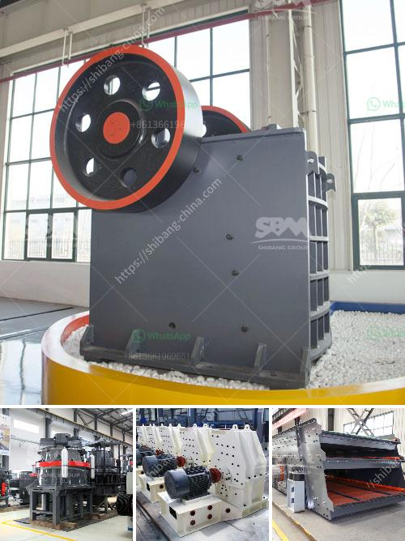

<h3>stone crusher kapasitas</h3>
Stone crushing industry is an important industrial sector in the country. The crushed stone is used as raw material for various construction activities such as the construction of roads, bridges, buildings, and canals. Over the years, this industry has seen remarkable growth due to the increasing demand for construction materials.

To meet this demand, stone crusher machines are widely utilized in various sites. One such machine that has become an essential part of many projects is the stone crusher kapasitas. This powerful machine is designed to crush stones into smaller sizes for further usage in construction activities.

The stone crusher kapasitas is a reliable and efficient solution for crushing stones. It uses high-quality materials to ensure sturdy construction, durability, and optimum performance. The machine is equipped with advanced features such as a hydraulic system that allows for easy adjustment of the size of the stones being crushed. This enables the user to produce stones of different sizes according to the specific requirements of the project.

The stone crusher kapasitas is also highly versatile as it can crush various types of stones including granite, basalt, limestone, and river pebbles. This makes it suitable for a wide range of applications in different industries. Whether it is a small construction project or a large-scale infrastructure development, this machine can handle the crushing needs efficiently.

One of the key advantages of the stone crusher kapasitas is its mobility. It can be easily transported to different sites, allowing for flexibility in crushing operations. This is especially beneficial for projects that require on-site stone crushing, as the machine can be moved closer to the construction site, minimizing the transportation costs and time.

Furthermore, the stone crusher kapasitas is designed to operate with minimal noise, vibration, and dust emissions. This is crucial, especially when working in urban areas where noise pollution is a concern. The machine is equipped with soundproofing materials and advanced dust suppression systems to ensure a safe and healthy working environment.

In conclusion, the stone crusher kapasitas is a reliable and efficient solution for crushing stones. With its sturdy construction, advanced features, and high mobility, it is suitable for various applications in the construction industry. Its versatility, low noise, and dust emissions make it an ideal choice for projects in urban areas. Investing in a stone crusher kapasitas can significantly improve productivity, reduce costs, and adhere to environmental regulations.
<h3>Contact us</h3><ul><li><strong>Whatsapp:&nbsp;<a href="https://wa.me/8613661969651">+8613661969651</a></strong></li><li><a href="https://swt.shibang-china.com/?git&amp;zhl&amp;stone crusher kapasitas"><strong>Online Service(chat now)</strong></a></li></ul><h3>Related</h3><ul><li><a href='stone crusher used machinery for sale in india.md'>stone crusher used machinery for sale in india</a></li><li><a href='mobile crusher on rent for iron ore.md'>mobile crusher on rent for iron ore</a></li><li><a href='belt conveyor for stone aggregate.md'>belt conveyor for stone aggregate</a></li><li><a href='iron processing plant in mexico.md'>iron processing plant in mexico</a></li><li><a href='hammer mill capacity 80 ton per hour.md'>hammer mill capacity 80 ton per hour</a></li></ul>