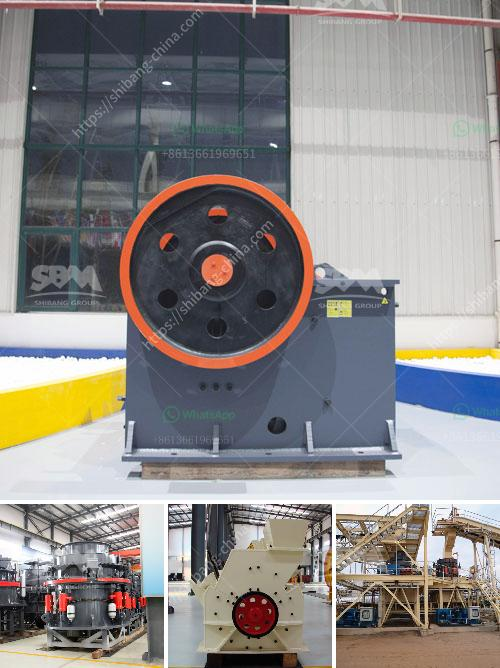

<h3>stone crusher kenya</h3>
Stone crusher Kenya is an important part of the mining machinery which is widely used in the mining industry. Kenya has abundant mineral resources and it is a mainstay economic pillar in the country's economic development. With the continuous development of Stone Crusher Kenya, the mining machinery industry is not only facing fierce competition, but also facing more and more challenges. In order to strengthen the competitiveness of the mining machinery industry, it is necessary to improve the technology level and innovation ability of Stone Crusher Kenya.

The Stone Crusher Kenya is an ideal equipment for the treatment of construction waste. It is mainly used to crush and process construction waste. Among them, its high crushing efficiency, large output and low energy consumption have won the favor of users. In addition, its price is reasonable and affordable. It is the best choice for users' investment. It can not only effectively solve the problem of construction waste accumulation, but also promote the harmonious development of economy and environment.

The Stone Crusher Kenya can be divided into three types: coarse crushing, medium crushing and fine crushing. The selection principle is based on the properties of the materials to be crushed. When the hardness of the material is high, the crushing ratio should be appropriate; when the moisture content of the material is large, the feeding method should be appropriate; when the output requirements are high, the crushing equipment with large processing capacity should be selected. Moreover, the Stone Crusher Kenya can also be configured according to the customer's site conditions, materials and finished product requirements to better meet the needs of customers.

The Stone Crusher Kenya has a wide range of applications, and can process materials such as limestone, granite, basalt, iron ore, river pebbles, construction waste, etc. Users can choose the appropriate model according to their actual needs. In addition, the Stone Crusher Kenya is flexible and convenient to operate, and has low requirements on the working environment. It can be used not only for fixed operations, but also for mobile operations. It is an ideal choice for the majority of users.

In addition, in order to promote the sustainable development of Stone Crusher Kenya, the government should also strengthen supervision and management, strictly control the quality of the Stone Crusher Kenya, and encourage the research and development of advanced technology, so as to continuously upgrade the technology level of the Stone Crusher Kenya, improve its production efficiency, reduce its energy consumption, and promote the healthy and rapid development of the mining machinery industry in Kenya.

In conclusion, Stone Crusher Kenya is an ideal equipment for the treatment of construction waste. It has high crushing efficiency, large output and low energy consumption. It is the best choice for users' investment. In order to promote the sustainable development of Stone Crusher Kenya, the government should strengthen supervision and management, and encourage the research and development of advanced technology. Stone Crusher Kenya will have a broader development prospect and contribute more to the economic development of Kenya.
<h3>Contact us</h3><ul><li><strong>Whatsapp:&nbsp;<a href="https://wa.me/8613661969651">+8613661969651</a></strong></li><li><a href="https://swt.shibang-china.com/?git&amp;zhl&amp;stone crusher kenya"><strong>Online Service(chat now)</strong></a></li></ul><h3>Related</h3><ul><li><a href='jaw crusher capacity.md'>jaw crusher capacity</a></li><li><a href='impact crushers nigeria.md'>impact crushers nigeria</a></li><li><a href='graphite production machine.md'>graphite production machine</a></li><li><a href='germany hammer crusher.md'>germany hammer crusher</a></li><li><a href='dolomite grinding mill for sale in india.md'>dolomite grinding mill for sale in india</a></li></ul>