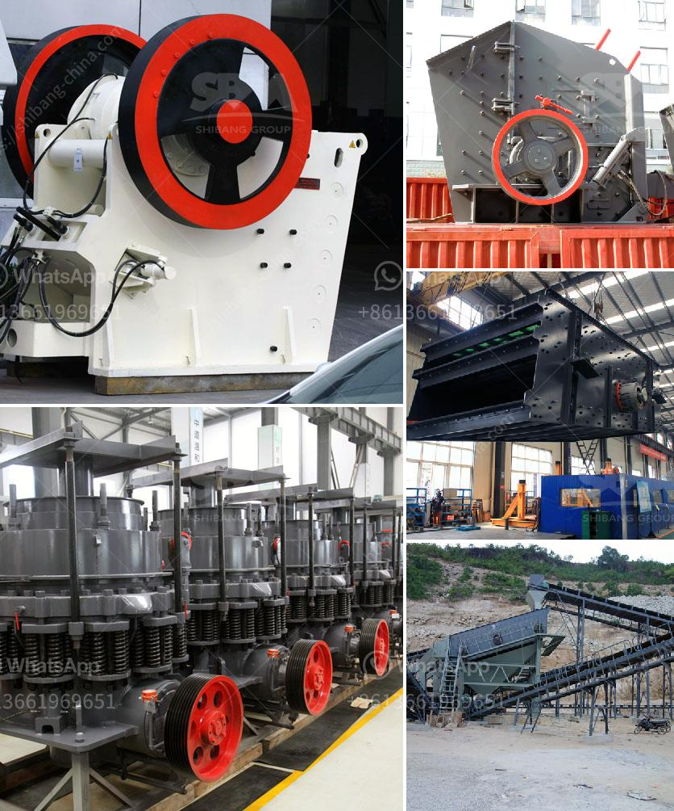

<h3>stone crusher machine dubai</h3>
Stone crusher machine is used for crushing stones into smaller size or change the form such as limestone, quartz, marble, granite and recycle building waste materials such as debris, asphaltic cement concrete. Generally, the stone crusher machine in dubai is used for crushing stones or rocks into small pieces. Dubai also offers gravel in various sizes, which can be used for construction and road building.

There are many machines which are used for crushing stones. Some popular machines include jaw crusher, impact crusher, cone crusher, hammer crusher, vibrating feeder, vibrating screen, belt conveyor and sand washing machine. Stone crusher machines are built to handle different ranges of rocks and stones. Some are small, while others are large in size. The capacity of the stone crusher machine ranges from 1 ton to 12 tons per hour.

The stones are fed into the crusher machines depending on their size. The machines crush the stones into smaller pieces or even into fine sand. The stones are then used in various construction purposes, such as buildings, roads, bridges, railways, etc. The stone crusher machine is one of the most important equipment in many industries.

So, the stone crusher machine plays vital role in the construction industry, and is preferred over other industrial equipment due to its recycling capabilities. It can also be used in various industries such as metallurgy, mining, building materials, chemical engineering, transportation, etc. The stone crusher machine can handle various types of stones and rocks, such as limestone, granite, pebbles, etc.

The stone crusher machine is widely used in the construction industry, metallurgy industry, mining industry, chemical industry, etc. It can be used for crushing rocks or stones into smaller pieces to be used in construction, road building, cement production, etc. There are many types of stone crusher machines available in the market, including roller crushers, cone crushers, impact crushers, and jaw crushers.

Overall, stone crusher machines are essential equipment in the construction and mining industry, and they are mainly used to crush large stones into small pieces for various building purposes. These machines are built to withstand tough conditions and are popular due to their high efficiency and recycling capabilities. Dubai is one of the major destinations for stone crusher machines, and the city is known for its high-quality materials used in construction projects.
<h3>Contact us</h3><ul><li><strong>Whatsapp:&nbsp;<a href="https://wa.me/8613661969651">+8613661969651</a></strong></li><li><a href="https://swt.shibang-china.com/?git&amp;zhl&amp;stone crusher machine dubai"><strong>Online Service(chat now)</strong></a></li></ul><h3>Related</h3><ul><li><a href='mobile crusher cone france.md'>mobile crusher cone france</a></li><li><a href='grinding mills in pakistan.md'>grinding mills in pakistan</a></li><li><a href='marbel grinding machine.md'>marbel grinding machine</a></li><li><a href='what is expected cost of 100 tph crushing plant.md'>what is expected cost of 100 tph crushing plant</a></li><li><a href='calcium carbonate machine supplier in turkey.md'>calcium carbonate machine supplier in turkey</a></li></ul>