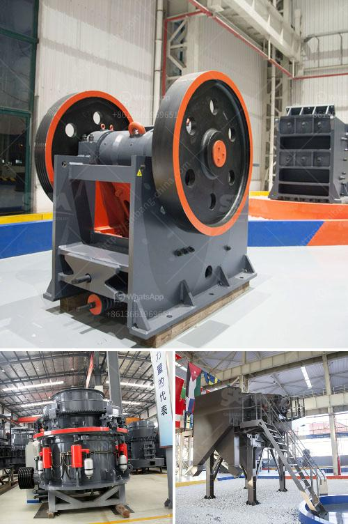

<h3>stone crusher machine for sale uae</h3>
Stone crushing machine is used to crush stones into small size or change the form such as limestone, quartz, marble, granite and recycle building waste materials such as debris, asphaltic cement concrete. Usually in stone crushing plant, Jaw crusher is used as primary crusher machine, when big stones are crushed smaller by Jaw crusher; they are transferred to Impact crusher or Cone crusher for secondary or tertiary crushing, then go through the stone shaping machine for getting cubic size. 

Stone crushing machine for sale in United Arab Emirates has been widely used in limestone, quartzite, sandstone, cobblestone and some others are easily crushed by cone crusher. Stone consists of various minerals. Stone crusher machine can be regarded as one of the most important crushing equipment in mining industry. The machine is mainly used for crushing various materials on the working site.

The cone crusher machine can crush debris and stones continuously and simultaneously. The materials processed by cone crusher are crushed by impacting and squeezing between the concave plate and mantle plate. The crushing process is continuous and the machine has a large crushing ratio. Besides that, it has an outstanding crushing effect in the second and third crushing stages. Stone crusher machine is engineered using the advanced engineering techniques. They are used in mining, construction, metallurgy, chemical engineering, electricity, petroleum, transportation, water conservancy, and blacksmithing industries.

Stone crushing plant is widely used in numerous fields such as mineral industry, chemical industry, construction industry, construction waste recycling, mining, cement plant, coal crushing industry, suitable for crushing hard, medium hard ore over a variety of and rocks. It is widely used in metallurgical industry, chemical industry, phosphate industry, mining, cement, building materials industry and thermal power generation, etc.

The stone crushing equipment is also known as the stone crusher machine. It is a type of crushing equipment that is used as an industrial solution for crushing stones or rocks into smaller pieces. The stone crushing machine is widely used in different industries, such as metallurgy, mining, building materials, chemical industry, and so on. It is divided into two main types, the first one is the jaw crusher and the second one is impact crusher.

The stone crusher machine for sale in UAE is widely used for crushing and screening various rocks and ores, including basalt, granite, limestone, iron ore, concrete aggregate, copper ore, gold ore, bauxite, etc. The crushed stone materials are conveyed to crushing plant by belt conveyor for secondary crushing before they are sent to vibrating screen to be separated.

Stone crushing plant has diverse applicational ranges. It is suitable for various rice fields, constructions, buildings, parks, highways, parking lots, bridges, tunnels, driveways, etc. Stone crusher machine for sale in UAE has been widely used in mining, metallurgy, construction, chemical industries and so on. In the longer term, the market scope of stone crusher machine in the future market will be wider. With great advantages of urbanization, continuously improve the country's environmental protection and governance in the past two years, due to booming economies that developers and investors have set up their own construction projects. All of these factors will definitely drive the expansion of UAE market demand for stone crusher equipment. Sooner or later, the success of this market will increase.
<h3>Contact us</h3><ul><li><strong>Whatsapp:&nbsp;<a href="https://wa.me/8613661969651">+8613661969651</a></strong></li><li><a href="https://swt.shibang-china.com/?git&amp;zhl&amp;stone crusher machine for sale uae"><strong>Online Service(chat now)</strong></a></li></ul><h3>Related</h3><ul><li><a href='equipment required for producing lime for new plant.md'>equipment required for producing lime for new plant</a></li><li><a href='used portable stone crusher machine for sale usa.md'>used portable stone crusher machine for sale usa</a></li><li><a href='double roller crusher manufacturer.md'>double roller crusher manufacturer</a></li><li><a href='usd jaw crusher in turkey.md'>usd jaw crusher in turkey</a></li><li><a href='crusherstone machine in china.md'>crusherstone machine in china</a></li></ul>