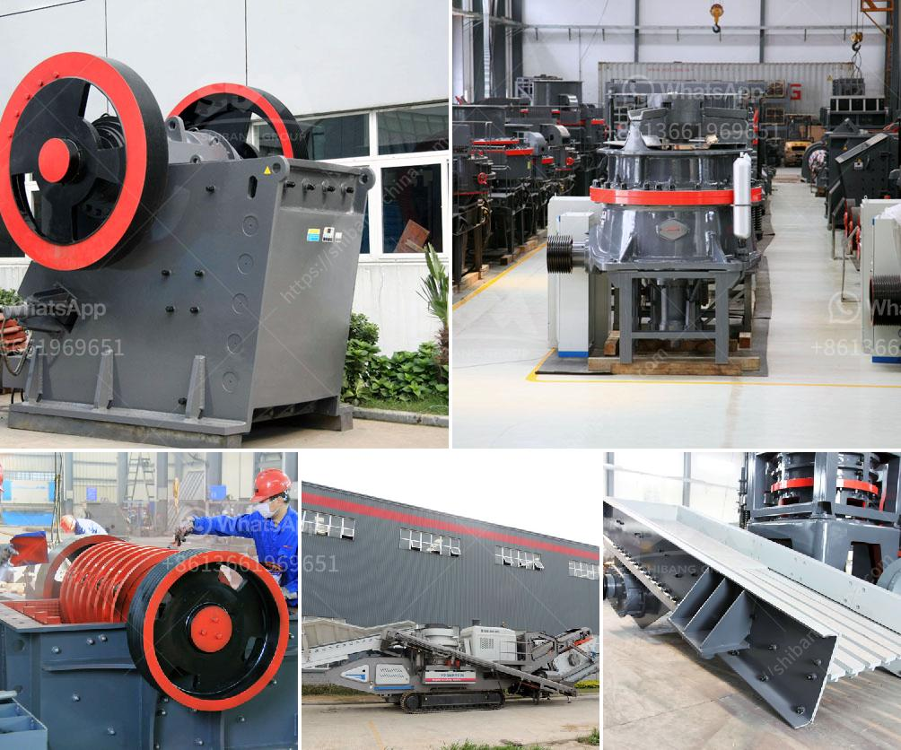

<h3>stone crusher machine in malaysia</h3>
Stone crusher machines are widely used in mining industry, construction industry, metallurgy industry, chemical industry, etc. SBM is a professional stone crusher machine manufacturer and supplier located in China. With decades experience, SBM develops various forms of stone crushing machine for different applications.

In Malaysia, stone crusher machines are available in different sizes and designs. They can be used for crushing different raw materials such as rock, ore, limestone, coal, gypsum, clay, etc. In terms of major brands, the machines offered by SBM include jaw crusher, impact crusher, cone crusher, and hammer crusher.

There are many different types of stone crusher machines available in the market. Depending on the application and desired output size, customers can select a suitable machine for their crushing needs. For instance, if the raw material is rock, then a jaw crusher or impact crusher would be a good choice. If the raw material is ore, limestone, or coal, then a cone crusher or hammer crusher would be more suitable.

The stone crusher machine in Malaysia is widely used in ore mining, construction waste recycling, construction aggregate production, highway, railway, bridge and the production of industrial artificial sand. Nowadays, SBM has exported several sets of stone crusher machines to Malaysia, and also has abundant experiences in research and development of stone crusher machines.

In conclusion, SBM offers the stone crusher machines in Malaysia which include jaw crusher, impact crusher, cone crusher, hammer crusher, vertical shaft impact crusher, etc. It is best choice for crushing various raw materials into different sizes. With high productivity and low maintenance, the stone crusher machines are ideal for quarrying, mining, demolition, and recycling applications.
<h3>Contact us</h3><ul><li><strong>Whatsapp:&nbsp;<a href="https://wa.me/8613661969651">+8613661969651</a></strong></li><li><a href="https://swt.shibang-china.com/?git&amp;zhl&amp;stone crusher machine in malaysia"><strong>Online Service(chat now)</strong></a></li></ul><h3>Related</h3><ul><li><a href='cost of a stone crusher machine.md'>cost of a stone crusher machine</a></li><li><a href='200tph old cone crusher plant india hyderabad.md'>200tph old cone crusher plant india hyderabad</a></li><li><a href='stone quarry machines for sale.md'>stone quarry machines for sale</a></li><li><a href='coal vertical mill.md'>coal vertical mill</a></li><li><a href='economic analysis of conveyor system.md'>economic analysis of conveyor system</a></li></ul>