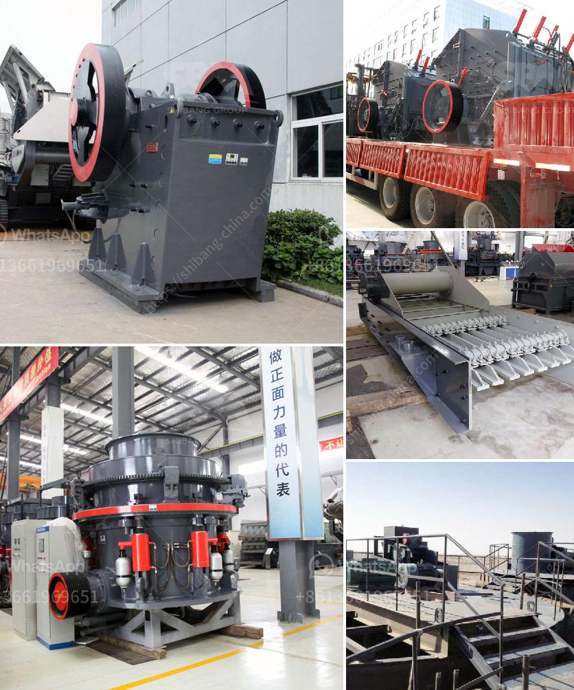

<h3>stone crusher machine in nigeria</h3>
Stone crusher machine, widely used in ore mining, construction, building materials, highways, railways, water conservancy and chemical industries, is a kind of crushing equipment that can replace the traditional sand making machine. It is applicable to various rocks, concrete, granite, limestone, etc., with a particle size of not more than 500mm and a compressive strength of not more than 350MPa.

Nigeria is a country blessed with abundant natural resources. It has numerous mineral resources, and most of which are of economic quantity. The main minerals in Nigeria are bauxite, coal, tin, iron ore, columbite, limestone, gold, lead, and zinc. Other minerals found in Nigeria includes gypsum, aluminum, lignite, salts, asbestos, and so on. The mining of these natural resources brings both opportunities and challenges for Nigeria.

Stone crusher machine in Nigeria is a necessary device in mining machinery. It is mainly used to crush large ore into smaller particles. It is essential equipment in the construction and mining industry and plays a vital role in the development of these sectors.

Coal, limestone, marble, granite, and so on are all natural resources that need to be mined. Under the ground, the technology and equipment of mining machinery are constantly improving. Over the years, many local companies have emerged and engaged in the production and sales of mining machinery, such as crushers, grinders, vibrating screens, etc. These mining machines can process various materials such as ores, rocks, and stones.

The daily processing capacity is up to 100-300 tons. With high productivity, low energy consumption, and low costs, stone crusher machines are popular in Nigeria. The crushing ratio of stone crusher machine is relatively large and the particle size of the finished product is uniform, thus reducing the energy consumption of the entire process.

The machine is suitable for crushing hard rock and mineral materials, such as iron ore, quartz stone, copper ore, granite, basalt, limestone, etc. The cone crusher, spring cone crusher, and hydraulic cone crusher are suitable for fine crushing. Impact crusher and hammer crusher are suitable for medium crushing. Crushing, the jaw crusher and the gyratory crusher have similarities in the crushing principle. However, it differs only in structure and working performance. The stone crusher machine in Nigeria is sold locally and provided by many stone crusher machine suppliers.

In Nigeria, the stone crusher machines have widely applications in mining industry, construction, metallurgy, chemical industry, and so on. There are many suppliers and manufacturers of stone crusher machines in Nigeria. Shanghaism is one of them, which has been sold to more than 170 countries. With good reputation and advanced technology, Shanghai has gained a lot of trust among customers. Committed to providing customers with comprehensive solutions, Shanghai helps customers achieve success in the mining industry.

In conclusion, the stone crusher machine in Nigeria is versatile and has a wide range of applications in mining, construction, metallurgy, chemical, and other industries. The cost of this machine is high, but the price of its equipment is also very reasonable, coupled with its excellent performance. Choosing a high-quality machine will allow you to enjoy its high productivity and low energy consumption benefits, creating more value for your project and promoting economic development in Nigeria.
<h3>Contact us</h3><ul><li><strong>Whatsapp:&nbsp;<a href="https://wa.me/8613661969651">+8613661969651</a></strong></li><li><a href="https://swt.shibang-china.com/?git&amp;zhl&amp;stone crusher machine in nigeria"><strong>Online Service(chat now)</strong></a></li></ul><h3>Related</h3><ul><li><a href='stone crusher 60 to 100 tonnes per hour.md'>stone crusher 60 to 100 tonnes per hour</a></li><li><a href='price hammer mill capacity of made in china.md'>price hammer mill capacity of made in china</a></li><li><a href='stone crusher hospital dhaka.md'>stone crusher hospital dhaka</a></li><li><a href='philippines stone crusher.md'>philippines stone crusher</a></li><li><a href='vertical grinder mill price.md'>vertical grinder mill price</a></li></ul>