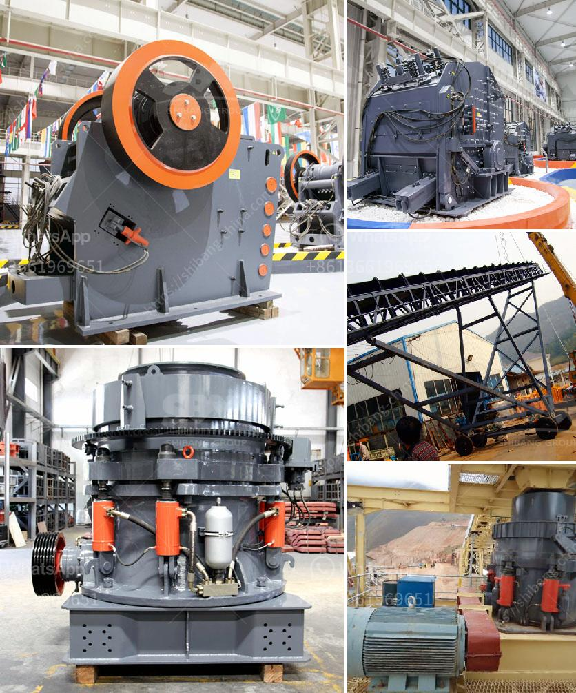

<h3>stone crusher machine in the philippines for rent</h3>
Stone crusher machine is widely used in mineral, quarry, building materials, road, railway, water conservancy and hydropower. The primary crushing machine is designed to handle large stones due to its immense strength; breaking strong chunks of granite or limestone into smaller pieces is commonly carried out using a jaw crusher. 

Cone crushers are larger and are popular in mines and quarries as they can crush various types of rocks due to their versatility. On the other hand, impact crushers are used for softer rocks like limestone and other materials with lower abrasiveness. These crusher machines are usually made with high-quality materials for better durability and long-lasting performance.

In the Philippines, crusher machines have been widely sold by local companies. Some of them are Caterpillar, Sandvik, Powerscreen, Cedarapids, McCloskey, and Kleemann. Since the arrival of the new century, there has been an increasing demand for these machines in the country, partly due to the economic growth and infrastructure development that has occurred.

Renting a machine in the Philippines can be an excellent alternative for businesses that do not want to invest in a new one upfront. However, for those who intend to use the stone crusher machine for a long time or run multiple sites, renting the equipment may not be a feasible option. Thus, businesses that rely on stone crushing as their main source of income should invest in a mobile crusher machine that can be easily transported to different locations.

Overall, companies that require rental services for stone crushing equipment in the Philippines can consolidate their needs on platforms such as Machines.ph. With numerous suppliers who provide a wide range of equipment, these platforms offer efficiency and convenience when it comes to sourcing machinery. By utilizing the services provided by these platforms, businesses can find affordable rental options according to their specific requirements and operational needs.
<h3>Contact us</h3><ul><li><strong>Whatsapp:&nbsp;<a href="https://wa.me/8613661969651">+8613661969651</a></strong></li><li><a href="https://swt.shibang-china.com/?git&amp;zhl&amp;stone crusher machine in the philippines for rent"><strong>Online Service(chat now)</strong></a></li></ul><h3>Related</h3><ul><li><a href='second hand ball mill europe.md'>second hand ball mill europe</a></li><li><a href='plant for manufacturing of wet ground calcium carbonate.md'>plant for manufacturing of wet ground calcium carbonate</a></li><li><a href='roller mill working.md'>roller mill working</a></li><li><a href='buyers ball mill process.md'>buyers ball mill process</a></li><li><a href='crushing plant in pakistan.md'>crushing plant in pakistan</a></li></ul>