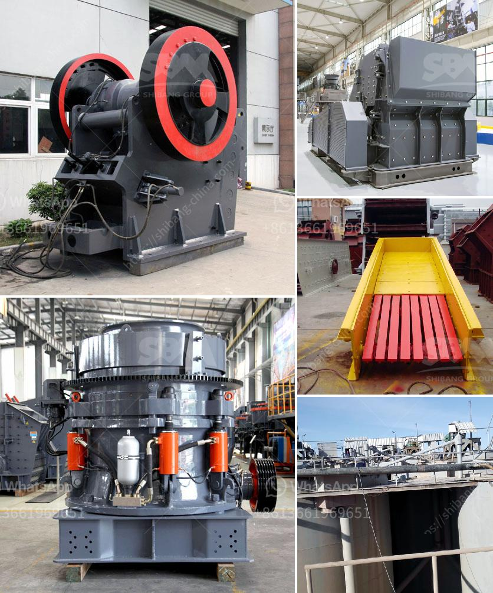

<h3>stone crusher machine price for plant</h3>
As technology advances, the crusher industry has also been developing. In order to meet the growing needs of the construction industry and machinery market, various types of crushing machines have been produced. Stone crusher machines are widely used in mining, smelting, building materials, highways, railways, water conservancy, and chemical industries.

The stone crushing machine is a reliable and functional tool for mining and construction purposes, designed to crush stones of different sizes into smaller pieces. The machine is commonly used for primary crushing of various hardness stones. The crusher is highly adaptable and can be used in a variety of working conditions.

The price range of the stone crusher machine is quite reasonable, ranging from a few thousand dollars to several hundred thousand dollars. Crushers with a low production capacity are generally cheaper, while crushers with a high production capacity are comparatively expensive. However, with advancements in technology, the cost of production for stone crusher machines has become more affordable.

When choosing a stone crusher machine, it is important to consider factors such as the materials to be crushed, the required particle size, the capacity, and the output size. Different types of crushers are available in the market, each with its own unique features and advantages.

In addition to the machine itself, the price of the stone crusher also includes factors such as the brand, model, after-sales service, and transportation. It is advisable to compare different models and choose a reputable manufacturer with good after-sales support.

Overall, the stone crusher machine price for plant varies depending on the requirements and specifications of the project. It is recommended to consult with professionals or manufacturers to get accurate quotes and choose the most suitable machine for efficient and cost-effective crushing operations.
<h3>Contact us</h3><ul><li><strong>Whatsapp:&nbsp;<a href="https://wa.me/8613661969651">+8613661969651</a></strong></li><li><a href="https://swt.shibang-china.com/?git&amp;zhl&amp;stone crusher machine price for plant"><strong>Online Service(chat now)</strong></a></li></ul><h3>Related</h3><ul><li><a href='raymond grinder pakistan.md'>raymond grinder pakistan</a></li><li><a href='150 ton per hour gold wash plant.md'>150 ton per hour gold wash plant</a></li><li><a href='iron processing plant in mexico.md'>iron processing plant in mexico</a></li><li><a href='diamond stone crusher mumbai.md'>diamond stone crusher mumbai</a></li><li><a href='stone crusher pe price.md'>stone crusher pe price</a></li></ul>