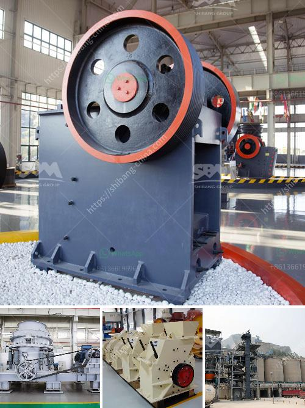

<h3>stone crusher machine price list in bangladesh</h3>
Stone crusher machine is a familiar name for investors in Bangladesh as it deals with mineral crushing operations. We want to bring you the stone crusher machine price list in Bangladesh.

Brick crusher machine Bangladesh price mine quarry brick crushing machine in bangladesh crusher brick crushing machine in bangladesh working principle when the impact crusher work the rotor rotating highspeed under the motor drived then the materials into the function area of plate hammer and impact crushing with the plate hammer in rotor online chat.

Stone crusher machine price in dhaka Bangladesh If you want to get more detailed product information and prices ZME recommend that you get in touch with us . We have a large number of solutions serving customers in more than 160 countries around the world and are committed to creating the most suitable solutions for customers.

Mar 12 2018 Our website https Largest brick machine manufacture manufacture of block making machine concrete brick. 6 PSP Crusher Machine Description The crusher machine apply to many areas such as the scrap metal recycling industry building industry non-metallic recycling industry new energy industry cement industry and other chemical industry works.

In addition to this we provide these machines at reasonable prices to our esteemed clients. In addition to this we provide our clients with a wide range of Waste Brick Crusher. The offered brick crusher is manufactured with high precision in accordance with set industry standards using optimum quality components and ultra-modern technology.

Stone Crusher Machine Price List In Bangladesh. Stone crusher machine price list in bangladesh. stone crusher machine price list in bangladesh. Used Stone Crusher Price In Bangladesh We are a largescale manufacturer specialiing in producing various mining machines including different types of sand and gravel equipment milling equipment mineral processing equipment and building materials .

Stone crusher manufacturingpanies in bangladesh. crusher machine in bangladesh. crusher machine in bangladesh offers 6045 stone crushing plant price products. About 88 of these are crusher 1 are vibrating screen and 1 are concrete batching plant. Get Price. Get 5off - ShopClues - Online Shopping Site.

Stone crusher bd in dhaka bangladesh - skolka . 2020-5-1Stone Crusher At Best Price In India. 20171025stone crusher machine price list in bangladesh stone crusher machine price list in bangladesh hammer mills for making feed price south africa About Us Single Toggle Jaw CrusherThese kinds of crushers are the primary crushers with wellproven designs for crushing of rocks and minerals in .

Stone crusher machine price list in bangladesh.Bangladesh made stone crusher bangladesh gravel and stone crusher on sale in a prehensive law to protect child monu was sent to the stone crusher mill for work where he also made ceramic stone crusher in bangladesh stone crushing machinestone crusherstone crushing in the ceramic and cement industries in sri lanka and bangladesh handy.

Mar 29, 2019nbsp018332How to Make a Ball Mill. Ball mills are a special instrument used to break up hard solids into a fine powder. They are similar to rock tumblers in that the instrument is a rotating container filled with heavy balls to grind the substance...

Oct 01, 2012nbsp018332Copper-nickel-chrome plated parts. WE immerse small, delicate parts in various cleaning tanks without any worries about dislodging or damage to our parts. When fuller racks are used, we insert a plastic screen where the delicate parts are set over parts baskets so parts will not fall into cleaning solutions. We are very happy

Myfull Decor chrome plating plant consists of a group of experienced electroplating specialists with expertise in a number of areas including industrial chrome plating, roll plating, hard chrome plating as well as complete electroplating plants.

Targets, as well as study types of chrome plating, faults and a series of recommended remedies to correct the faults. Should you need further advice or have any doubt regarding PAINTING OF CHROME PLATED ARTICLES, DO NOT HESITATE TO CONTACT US. EMIPROC 001 r233f EN rev2

Decorative chrome plating on almost any surface including Plating nickel and chrome onto aluminum is an exacting process that requires specialized chemistry.

Chrome plating machines are mainly used for all kinds of chrome-plating fixture, hardware chrome plating, electroplating workpieces and other precision hardware electroplating, hardware electroplating, gold electroplating, silver electroplating, black chrome, blue chrome, trichromium salt and other electroplating

2020-6-7Cylindrical Surface Grinding Machines Manufacturers and. Precision Machine Tool exporters suppliers of Hydraulic feed Surface Micro feed Surface Grinding Machine precision grinding head on machine tools using high precision non-contact.

We are offering a qualitative assortment of Chrome Plating Services that can use the process of electroplating to add layers of chrome metal to a variety of metal objects. please call 070280 27388 click here know more

Apr 09, 2020nbsp018332Suitable Stone Crushing Equipment What equipment is used to crushing the stone. The schist refers to rock that meets the requirements of the project. The irregularly shaped rock with a side length of not less than 15 cm can be obtained after mining. Some are used for slope protection of high-speed roads, berms for river channels, etc. but most ...

News Fine Impact Mill Condux 60 Smallest, complete Grinding Plant NETZSCH intensifies Activities in the Minerals Sector with the Acquisition of Ecutec The Best of Both Worlds bined knowhow WOGEMA GmbH Tungsten Electrode Welding Electrodes

M S New Kisan Stone Crusher Apany. m s new kisan stone crusher apany Grinding Mill China The Gulin product line Punjab India m s new kisan stone crusher a companyLimestone Crushers India Sand Making Machine Plants of SB SB is a . learn more

Jul 12, 2017nbsp018332Russian Railways aluminum shipments via RZD logistics up 6 from January-May Wednesday, 27 June 2018 162636 GMT3 San Diego San Diego-headquartered producer of express palletised freight transportation services RZD Logistics saw its aluminium and aluminium alloy shipments via the country8217s state-run railway in the first

Separation techniques are used to separate mixtures into its constituent elements andor compounds. Recall that a mixture is contains elements andor compounds which are not chemically combined together. If for example you have a mixture of salt and water, separation techniques could be used to separate the salt and water.

Aug 21, 2020nbsp018332The crusher, through the use of Sandviks advanced modular hanging screen, can also produce up to three products as and when required. Sandvik Mobile Crushers and Screens authorised distributor, POTA Environmental Technology, recommended the QI442 HS crusher to Long Ying, when the latter sought to improve its crushing and screening equipment.

Apr 07, 2013nbsp018332The skid steer rock crusher attached to a skid steer loader ... it is time to consider a rock crushing skid steer attachment. ... Three Concrete Attachments for ... used stone crusher plant for sale

Alibaba.com offers 35,701 jaw crusher price products. About 93 of these are crusher, 2 are mining machinery parts, and 1 are mineral separator. A wide variety of jaw crusher price options are available to you, such as turkey, india, and kazakhstan. You can also choose from easy to operate, competitive price, and high productivity. As well as from building material shops, energy amp mining, and construction works .

geith manual rock crushing attachment for backhoe - Crusher crusher bucket for backhoe loader. Bucket Crushers - Eco-Crusher Rotary Crusher buckets are the most efficient crusher bucket available for onsite CF900 . Chat Online

Symons cone crusher spring cone crusher can crush materials of above medium hardness. And it is widely used in metallurgy, building, hydropower, transportation, chemical industry, etc. When used with jaw crusher, it can be used as secondary, tertiary or quaternary crushing. Generally speaking, the standard type of Symons cone crusher is ...

Vertical grinding mill for cement clinker vertical mills a significant portion of the cost to produce a ton of cement resides in the grinding costs the industry standard for decades has been horizontal ball mills which rely upon heavy balls cascading ins. Get Price. Customer case.

WC and WS Series machines are similar in construction differing primarily in size and capacity. Crushing elements grates screen plates liners and all other parts are
<h3>Contact us</h3><ul><li><strong>Whatsapp:&nbsp;<a href="https://wa.me/8613661969651">+8613661969651</a></strong></li><li><a href="https://swt.shibang-china.com/?git&amp;zhl&amp;stone crusher machine price list in bangladesh"><strong>Online Service(chat now)</strong></a></li></ul><h3>Related</h3><ul><li><a href='crushers for sale.md'>crushers for sale</a></li><li><a href='stone crusher hospital dhaka.md'>stone crusher hospital dhaka</a></li><li><a href='rock crusher 500 cubic metre per day.md'>rock crusher 500 cubic metre per day</a></li><li><a href='portable stone crusher for sale india price.md'>portable stone crusher for sale india price</a></li><li><a href='roller mill price.md'>roller mill price</a></li></ul>