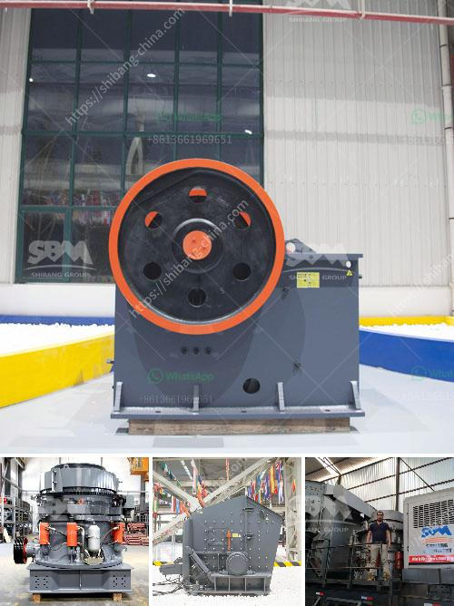

<h3>stone crusher machine spintex accra</h3>
Stone crusher machines play an important role in the construction industry as they reduce the size of large rocks into smaller rocks, gravel, or rock dust. These machines are commonly used in construction, mining, and demolition sites in Accra, Spintex.

The stone crushing machines in Accra, Spintex are made up of several components that work together for maximum efficiency and performance. The main parts of the machines include the conveyor belt, electric motor, rotor, and control panel. These parts work together to allow for continuous crushing and grinding of rocks into smaller sizes.

One of the key features of these machines is their ability to crush rocks of different sizes and hardness levels. They are designed to handle a wide range of materials, from soft limestone to hard granite, making them suitable for various construction projects. The machines also come with different crushing capacities to meet the specific needs of the project.

In Accra, the stone crusher machines are located along the Spintex road. Their close proximity to residential and commercial areas makes them a suitable choice for individuals and businesses in need of construction materials. The machines are easily accessible, allowing for quick and efficient transportation of the crushed rocks to the construction site.

The stone crusher machines in Spintex, Accra are safe to operate and require minimal maintenance. The machines are equipped with safety features such as emergency stop buttons and safety guards to prevent accidents and injuries. Additionally, regular maintenance checks and servicing are conducted to ensure optimal performance and longevity of the machines.

The stone crusher machines in Accra, Spintex are cost-effective and provide a reliable source of construction materials for contractors and homeowners. By crushing rocks into smaller sizes, the machines reduce the need for expensive materials, such as gravel and sand. This helps to lower construction costs and make projects more affordable.

Furthermore, the stone crusher machines in Accra, Spintex contribute to environmental sustainability. By recycling and reusing materials, the machines reduce the amount of waste generated from construction and demolition projects. This prevents the accumulation of waste in landfills and promotes a circular economy.

In conclusion, the stone crusher machines in Spintex, Accra play a crucial role in the construction industry. They reduce the size of rocks into smaller sizes, making them suitable for various construction projects. The machines are safe to operate, cost-effective, and environmentally friendly. They provide a reliable source of construction materials, contributing to the development and growth of the construction industry in Accra.
<h3>Contact us</h3><ul><li><strong>Whatsapp:&nbsp;<a href="https://wa.me/8613661969651">+8613661969651</a></strong></li><li><a href="https://swt.shibang-china.com/?git&amp;zhl&amp;stone crusher machine spintex accra"><strong>Online Service(chat now)</strong></a></li></ul><h3>Related</h3><ul><li><a href='hammer crusher buhler miag titan.md'>hammer crusher buhler miag titan</a></li><li><a href='gold stone crusher machine south africa.md'>gold stone crusher machine south africa</a></li><li><a href='stone crusher kenya.md'>stone crusher kenya</a></li><li><a href='limestone vertical mill.md'>limestone vertical mill</a></li><li><a href='grinding quartz mesh.md'>grinding quartz mesh</a></li></ul>