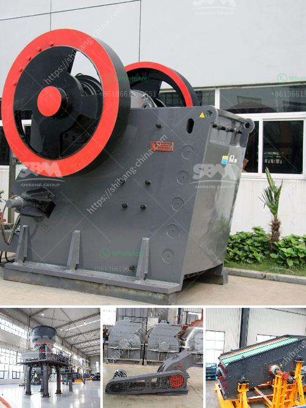

<h3>stone crusher machine uk</h3>
Stone crushing machines are used to crush stones into smaller-sized particles for various applications in construction, manufacturing, mining, and other industries. These machines come in a variety of designs and sizes to meet the diverse needs of customers in the UK.

The stone crusher machine in the UK is characterized by the innovation and advanced technology used in its development. This machine has been beneficial to the construction, manufacturing, and processing industries alike. It is a versatile machine that can handle a wide range of materials, making it ideal for various applications.

One of the main advantages of a stone crusher machine is its ability to process materials efficiently, reducing the need for costly transportation and labor. The crusher machine can handle a wide variety of materials, including limestone, granite, marble, basalt, and other hard and abrasive stones.

In the UK, stone crusher machines are popular devices that are used to break down large stone particles into smaller pieces. These machines allow builders, as well as individuals, to obtain the desired size of stones for various purposes. Whether it is for construction purposes, road building, or landscaping, stone crusher machines play a crucial role in ensuring that the desired size and shape of stones are obtained.

Furthermore, the stone crusher machine in the UK is also known for its high crushing ratio, strong production capacity, and low energy consumption. These features make it ideal for producing high-quality aggregates for various projects. Contractors and builders greatly benefit from these machines as they can complete their projects efficiently and cost-effectively.

In addition to its efficiency and reliability, the stone crusher machine in the UK is also designed to be user-friendly. It is equipped with advanced control systems and features that make operation and maintenance easy. The machines also come with safety measures, ensuring the well-being of operators and maintaining a safe working environment.

The stone crusher machine in the UK is available in different models to suit different applications and requirements. These machines can be stationary or mobile, allowing flexibility and convenience for users. In urban areas, where space is limited, mobile stone crusher machines are preferred as they can be easily transported from one location to another.

To sum up, the stone crusher machine in the UK is a valuable investment that offers numerous benefits to various industries. Its efficient and reliable performance, along with its user-friendly features, make it an ideal choice for construction, manufacturing, and mining applications. Investing in this versatile machine can enhance productivity, reduce costs, and contribute to the overall success of projects.

In conclusion, the stone crusher machine in the UK is an essential tool that helps process stones efficiently and effectively. Its versatility, high crushing ratio, and low energy consumption make it suitable for a wide range of applications. Whether used in construction, manufacturing, or mining, this machine proves to be a valuable asset for businesses in the UK.
<h3>Contact us</h3><ul><li><strong>Whatsapp:&nbsp;<a href="https://wa.me/8613661969651">+8613661969651</a></strong></li><li><a href="https://swt.shibang-china.com/?git&amp;zhl&amp;stone crusher machine uk"><strong>Online Service(chat now)</strong></a></li></ul><h3>Related</h3><ul><li><a href='pyrite coal mill pakistan.md'>pyrite coal mill pakistan</a></li><li><a href='dolomite mining plant price.md'>dolomite mining plant price</a></li><li><a href='gold wash plants for sale in south africa.md'>gold wash plants for sale in south africa</a></li><li><a href='prices of conveyor belt.md'>prices of conveyor belt</a></li><li><a href='cost of a small scale cement plant in india.md'>cost of a small scale cement plant in india</a></li></ul>